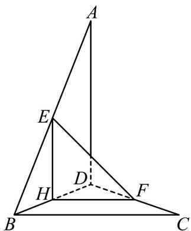

> [!faq]- 《专题8_6_空间直线_平面的垂直_高效培优讲义_》官方解析
>
> > [!success]- **【答案】** 证明见解析
>
> > [!note]- **【分析】**
> > 通过平移后再解三角形即可获得证明·
>
> > [!note]- **【解析】**
> > 证明：如图所示，取 $BD$ 的中点 $H$ ，连接 $EH$ ，FH
> >
> > 因为 E 是 AB 的中点，且 $AD=2$ ，
> >
> > 
> >
> > 所以 $EH^{\parallel}AD$ ， $EH = 1$ .同理 $FH^{\parallel}BC$ ， $FH = 1$
> >
> > 所以 $\angle EHF$ (或其补角) 是异面直线 $AD$ , $BC$ 所成的角.
> >
> > 因为 $EF = \sqrt{2}$ ，所以 $EH^{2} + FH^{2} = EF^{2}$
> >
> > 所以 $\triangle EFH$ 是等腰直角三角形，EF 是斜边，
> >
> > 所以 $\angle EHF=90^{\circ}$ ，即AD与BC所成的角是 $90^{\circ}$ ，
> >
> > 所以 $AD \perp BC$ .
