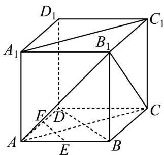

> [!faq]- 《专题8_6_空间直线_平面的垂直_高效培优讲义_》官方解析
>
> > [!success]- **【答案】** （1） $60^{\circ}$ （2）证明见解析
>
> > [!note]- **【分析】**
> > （1）根据正方体的性质，证出 $AC \parallel A_{1}C_{1}$ ，由此得到 $\angle B_{1}CA$ 就是 $A_{1}C_{1}$ 与 $B_{1}C$ 所成的角。然后在正三角
> >
> > 形 $\Delta ABC_{1}$ 中加以计算，可得 $A_{1}C_{1}$ 与 $B_{1}C$ 所成角的大小；
> >
> > (2) 平行四边形 $AA_{1}C_{1}C$ 中可得 $AC//A_{1}C_{1}$ ，可证 $EF//BD$ ，又 $AC \perp BD$ 即可得证；
>
> > [!note]- **【解析】**
> > 解：（1）如图，连接 $AC, AB_{1}$ ，由几何体 $ABCD - A_{1}B_{1}C_{1}D_{1}$ 是正方体，知四边形 $AA_{1}C_{1}C$ 为平行四边
> >
> > 形，所以 $AC \parallel A_{1}C_{1}$
> >
> > 从而 AC 与 $B_{1}C$ 所成的角为 $A_{1}C_{1}$ 与 $B_{1}C$ 所成的角，
> >
> > 由 $AB_{1}=AC=B_{1}C$ ，可知 $\angle B_{1}CA=60^{\circ}$ .
> >
> > 故 $A_{1}C_{1}$ 与 $B_{1}C$ 所成的角为 $60^{\circ}$ .
> >
> > 
> >
> > (2) 如图，连接 BD，易知四边形 $AA_{1}C_{1}C$ 为平行四边形，所以 $AC \parallel A_{1}C_{1}$
> >
> > 因为 EF 为 $\Delta ABD$ 的中位线，所以 $EF \parallel BD$ .
> >
> > 又 $AC \perp BD$ ，所以 $EF \perp AC$ ，所以 $A_{1}C_{1} \perp EF$ 。
