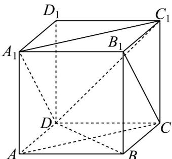

## 题型01 证明两直线垂直

【典例1】已知 $ABCD - A_{1}B_{1}C_{1}D_{1}$ 是正方体，则下列结论正确的是（ ）A. 直线 $A_{1}C_{1}$ 与 $B_{1}C$ 是异面直线 B. $A_{1}D$ 与 $B_{1}C$ 所成的角为 $60^{\circ}$ C. $A_{1}C_{1} \perp BD$ D. 直线 $A_{1}C_{1}$ 与 $B_{1}C$ 所成的角为 $60^{\circ}$

【答案】 ACD

【分析】由异面直线的判定判断 $^{A}$ ；证得线线平行判断 $^{B}$ ；由异面直线垂直判断 $^{C}$ ；求出异面直线所成角判断D.

【详解】对于 A， $B_{1}C \subset$ 平面 $BCC_{1}B_{1}$ ，点 $C_{1} \in$ 平面 $BCC_{1}B_{1}$ ， $C_{1} \notin B_{1}C$ ，而 $A_{1} \notin$ 平面 $BCC_{1}B_{1}$

$A_{1}, C_{1} \in$ 直线 $A_{1}C_{1}$ ，直线 $A_{1}C_{1}$ 与 $B_{1}C$ 是异面直线， $^{A}$ 正确；

对于 B，由 $A_{1}B_{1} // CD, A_{1}B_{1} = CD$ ，得 $\Box A_{1}DCB_{1}$ ，则 $A_{1}D // B_{1}C$ ，B 错误；

对于 C，由选项 B 同理得 $A_{1}C_{1} // AC$ ，而 $AC \perp BD$ ，则 $A_{1}C_{1} \perp BD$ ，C 正确；

对于 D，连接 $C_{1}D$ ， $B_{1}C // A_{1}D$ ，则 $\angle DA_{1}C_{1}$ 或其补角为异面直线 $A_{1}C_{1}$ 与 $B_{1}C$ 所成的角，

又 $A_{1}D, DC_{1}, A_{1}C_{1}$ 为正方体的面对角线，即 $A_{1}D = DC_{1} = A_{1}C_{1}$ ， $\angle C_{1}A_{1}D = 60^{\circ}$

因此异面直线 $A_{1}C_{1}$ 与 $B_{1}C$ 所成的角为 $60^{\circ}$ ，D 正确·故选：ACD

## 方法技巧

证明两直线垂直的常用方法

（1）利用平面几何的结论，如矩形，等腰三角形的三线合一，勾股定理；

(2) 定义法：即证明两条直线夹角是 $90^{\circ}$ ；

（3）利用一些事实：两条平行直线，若其中一条直线垂直另一条直线，则其平行线也垂直此直线。

![[高中/课堂同步/题库/人教A版高中数学同步讲义(2026)/02_必修第二册/第八章 立体几何初步/讲义/专题8_6_空间直线_平面的垂直_高效培优讲义_/题型01_证明两直线垂直_sec_11/questions/Q00065250.md]]
![[高中/课堂同步/题库/人教A版高中数学同步讲义(2026)/02_必修第二册/第八章 立体几何初步/讲义/专题8_6_空间直线_平面的垂直_高效培优讲义_/题型01_证明两直线垂直_sec_11/questions/Q00065251.md]]
![[高中/课堂同步/题库/人教A版高中数学同步讲义(2026)/02_必修第二册/第八章 立体几何初步/讲义/专题8_6_空间直线_平面的垂直_高效培优讲义_/题型01_证明两直线垂直_sec_11/questions/Q00065252.md]]
