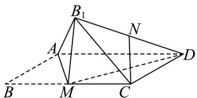

<!-- question-source:start -->
【变式2】如图，在菱形ABCD中， $AB = 2$ ， $\angle ABC = 60^{\circ}$ ， $M$ 为 $BC$ 的中点，将 $\triangle ABM$ 沿直线 $AM$ 翻折成

$\triangle AB_{1}M$ ，连接 $B_{1}C$ 和 $B_{1}D$ ， $N$ 为 $B_{1}D$ 的中点，连接 $CN$ 则在翻折过程中， $AB_{1}$ 与 $CN$ 的夹角为

<!-- question-source:end -->

![[高中/课堂同步/题库/人教A版高中数学同步讲义(2026)/02_必修第二册/第八章 立体几何初步/讲义/专题8_6_空间直线_平面的垂直_高效培优讲义_/题型02_求异面直线所成的角_sec_12/questions/answers/Q00065254A1.md]]
