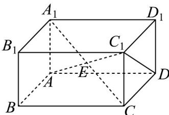

> [!faq]- 《专题8_6_空间直线_平面的垂直_高效培优讲义_》官方解析
>
> > [!success]- **【答案】** D
>
> > [!note]- **【分析】**
> > 连接 $AC_{1}$ 、 $C_{1}D$ ，分析可知异面直线 AE 与 BC 所成角为 $\angle C_{1}AD$ 或其补角，求出 $AC_{1}$ 的长，即可求出 $\angle CAD$
> >
> > $$
> > \angle C _ {1} A D
> > $$
> >
> > 的余弦值，即为所求·
>
> > [!note]- **【解析】**
> > 连接 $AC_{1}$ 、 $C_{1}D$ ，则 E 也为 $AC_{1}$ 的中点，如下图所示：
> >
> > 
> >
> > 在直四棱柱 $ABCD - A_{1}B_{1}C_{1}D_{1}$ 中，底面 ABCD 为矩形，故该直四棱柱为长方体，
> >
> > 又因为 $AB = AA_{1} = \sqrt{2}$ ，且 $AD = 2\sqrt{3}$ ，则 $AC_{1} = \sqrt{AB^{2} + AD^{2} + AA_{1}^{2}} = \sqrt{2 + 12 + 2} = 4$
> >
> > 因为 $C_1D = \sqrt{CD^2 + CC_1^2} = \sqrt{2 + 2} = 2$ ， $AD = 2\sqrt{3}$ ，所以 $AD^{2} + C_{1}D^{2} = AC_{1}^{2}$
> >
> > 故 $AD \perp C_{1}D$
> >
> > 因为四边形 $ABCD$ 为矩形，则 $BC \parallel AD$ ，所以异面直线 $AE$ 与 $BC$ 所成角为 $\angle C_{1}AD$ 或其补角，
> >
> > 且 $\cos\angle C_{1}AD=\frac{AD}{AC_{1}}=\frac{2\sqrt{3}}{4}=\frac{\sqrt{3}}{2}$ ，因此，异面直线 AE 与 BC 所成角的余弦值为 $\frac{\sqrt{3}}{2}$
> >
> > 故选 **D**.
