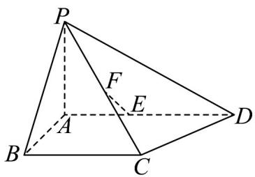

<!-- question-source:start -->
【变式1】如图所示的四棱锥 $P - ABCD$ 中， $PA \perp$ 平面 $ABCD$ ， $BC // AD$ ， $AB \perp AD$

$PA = AB = \sqrt{3}$ , AD = 3, BC = 2, $\overline{AD} = 3\overline{AE}$ , F 为 PC 的中点；

(1)求证： $EF \parallel$ 平面 PAB

(2)求证： $EF \perp$ 平面 PBC

(3)若 $P, B, C, D$ 在同一个球面上，证明：这个球的球心在平面ABCD上
<!-- question-source:end -->

![[高中/课堂同步/题库/人教A版高中数学同步讲义(2026)/02_必修第二册/第八章 立体几何初步/讲义/专题8_6_空间直线_平面的垂直_高效培优讲义_/题型03_直线与平面垂直的判定_sec_13/questions/answers/Q00065256A1.md]]
