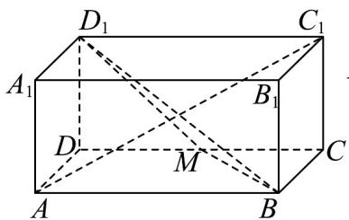
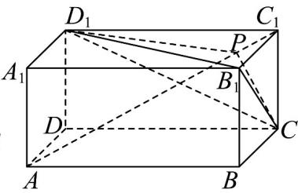
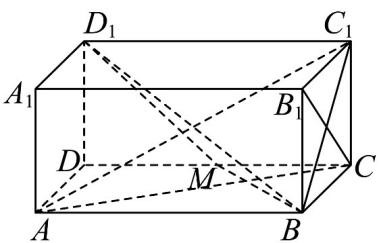
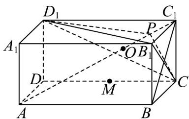

## 题型03 直线与平面垂直的判定

【典例1】如图，长方体 $ABCD - A_{1}B_{1}C_{1}D_{1}$ 中， $AB = m$ ， $AD = AA_{1} = 1$ ，点 $M$ 是棱 $CD$ 的中点.

(1)求异面直线 $B_{1}C$ 与 $AC_{1}$ 所成的角的大小；

(2)当实数 $m = \sqrt{2}$ ，证明：直线 $AC_{1}$ 与平面 $BMD_{1}$ 垂直；

(3)若 $m = 2$ .设 $P$ 是线段 $AC_{1}$ 上的一点（不含端点），满足 $\frac{AP}{AC_1} = \lambda$ ，求 $\lambda$ 的值，使得三棱锥 $B_{1} - CD_{1}C_{1}$ 与三

棱锥 $B_{1} - CD_{1}P$ 的体积相等.

【答案】(1) $90^{\circ}$ (2)证明见解析 (3) $\frac{1}{3}$

【分析】（1）连接 $BC_{1}$ ，可证 $B_{1}C \perp$ 平面 $ABC_{1}$ ，再由线面垂直的性质定理知 $B_{1}C \perp AC_{1}$ ，从而得解；

(2) 当实数 $m = \sqrt{2}$ ，由 $\frac{|AB|}{|BC|} = \frac{|BC|}{|CM|}$ ，证得 Rt△ ABC ∼ Rt△ BCM，再由三角形相似的性质证明 $AC \perp BM$ ，

结合线面垂直的判定定理证明 $BM \perp AC_{1}$ ，同理 $D_{1}M \perp AC_{1}$ ，从而得结论；

(3) 分别计算 $V_{B_{1}-CC_{1}D_{1}}$ ， $V_{A-B_{1}CD_{1}}$ 和 $V_{C_{1}-B_{1}CD_{1}}$ 的值，可得点 P 到平面 $B_{1}CD_{1}$ 的距离等于点 $C_{1}$ 到平面 $B_{1}CD_{1}$ 的距离，

且是点 A 到平面 $B_{1}CD_{1}$ 的距离的一半，从而确定点 P 的位置。

【详解】 $(1)$ 连接 $B_{1}C$ ，

由四边形 $BCC_{1}B_{1}$ 为正方形，可得 $B_{1}C \perp BC_{1}$

在长方体 $ABCD - A_{1}B_{1}C_{1}D_{1}$ 中， $AB \perp$ 平面 $BCC_{1}B_{1}$ ，又 $B_{1}C \subset$ 平面 $BCC_{1}B_{1}$

所以 $B_{1}C \perp AB$ ，因为 $AB\mathrm{I}BC_{1} = B$ ， $AB$ ， $BC_{1} \subset$ 平面 $ABC_{1}$

所以 $B_{1}C \perp$ 平面 $ABC_{1}$ ，又 $AC_{1} \subset$ 平面 $ABC_{1}$ ，所以 $B_{1}C \perp AC_{1}$

即异面直线 $B_{1}C$ 与 $AC_{1}$ 所成的角的大小为 $90^{\circ}$ ;

(2) 当 $m = \sqrt{2}$ 时， $\left|CM\right| = \frac{\sqrt{2}}{2}$

因为 $|BC|=1$ ，所以 $\frac{|AB|}{|BC|}=\frac{|BC|}{|CM|}=\sqrt{2}$

所以 Rt△ ABC ∼ Rt△ BCM ，则 ∠CAB = ∠MBC

所以 $\angle MBC + \angle ACB = \angle CAB + \angle ACB = 90^{\circ}$ ，即 $AC\perp BM$

在长方体 $ABCD - A_{1}B_{1}C_{1}D_{1}$ 中， $CC_{1} \perp$ 平面 ABCD，又 $BM \subset$ 平面 ABCD，

所以 $CC_{1} \perp BM$ ，因为 $AC \cap CC_{1} = C, AC, CC_{1} \subset$ 平面 $ACC_{1}$ ，

所以 $BM \perp$ 平面 $ACC_{1}$ ，又 $AC_{1} \subset$ 平面 $ACC_{1}$

所以 $BM \perp AC_{1}$

同理 $D_{1}M \perp AC_{1}$ ，又 $D_{1}M \cap BM = M, D_{1}M, BM \subset$ 平面 $BMD_{1}$

所以直线 $AC_{1} \perp$ 平面 $BMD_{1}$ ;

(3) 设 $AC_{1}$ 与平面 $B_{1}CD_{1}$ 的斜足为 O，

因为 $V_{C_{1}-B_{1}CD_{1}} = V_{B_{1}-C_{1}CD_{1}} = \frac{1}{3} \cdot \frac{1}{2} \cdot 1 \cdot m \cdot 1 = \frac{m}{6}$ ，

$$
V _ {A - B _ {1} C D _ {1}} = V _ {A B C D - A _ {1} B _ {1} C _ {1} D _ {1}} - V _ {B _ {1} - A B C} - V _ {B _ {1} - C _ {1} C D} - V _ {A - A _ {1} B _ {1} D _ {1}} - V _ {D _ {1} - A C D} = V _ {A B C D - A _ {1} B _ {1} C _ {1} D _ {1}} - 4 V _ {B _ {1} - C _ {1} C D _ {1}} = \frac {m}{3}
$$

所以 $V_{A - B_1CD_1} = 2V_{C_1 - B_1CD_1}$ ，则 $\left|AO\right| = 2\left|C_1O\right|$ ，故 $\left|C_1O\right| = \left|PO\right|$

所以在线段 $AC_{1}$ 上取一点 P，要使三棱锥 $B_{1}-CD_{1}C_{1}$ 与三棱锥 $B_{1}-CD_{1}P$ 的体积相等，

则 $P$ 为 $AO$ 的中点，即 $\frac{|AP|}{|AC_1|} = \frac{1}{3}$

## 方法技巧

应用判定定理的注意事项

利用直线与平面垂直的判定定理证明线面垂直的关键是在这个平面内找到两条相交直线，证明它们都和这条

直线垂直.

![[高中/课堂同步/题库/人教A版高中数学同步讲义(2026)/02_必修第二册/第八章 立体几何初步/讲义/专题8_6_空间直线_平面的垂直_高效培优讲义_/题型03_直线与平面垂直的判定_sec_13/questions/Q00065256.md]]
![[高中/课堂同步/题库/人教A版高中数学同步讲义(2026)/02_必修第二册/第八章 立体几何初步/讲义/专题8_6_空间直线_平面的垂直_高效培优讲义_/题型03_直线与平面垂直的判定_sec_13/questions/Q00065257.md]]
![[高中/课堂同步/题库/人教A版高中数学同步讲义(2026)/02_必修第二册/第八章 立体几何初步/讲义/专题8_6_空间直线_平面的垂直_高效培优讲义_/题型03_直线与平面垂直的判定_sec_13/questions/Q00065258.md]]
