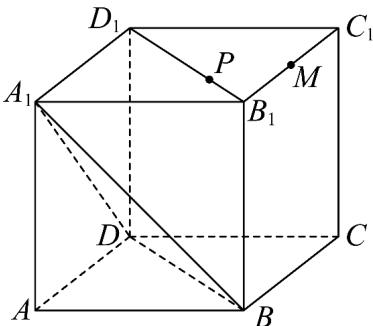

<!-- question-source:start -->
【变式1】如图，在棱长为 $2$ 的正方体 $ABCD - A_{1}B_{1}C_{1}D_{1}$ 中， $M$ 为 $B_{1}C_{1}$ 的中点， $P$ 为线段 $B_{1}D_{1}$ 上动点（包括端

点），则下列说法中正确的是（）

A. 存在 $P$ 点使得 $MP \parallel$ 平面 $A_{1}DB$ B. 直线 $BM$ 与平面 $BDD_{1}B_{1}$ 所成角正弦值为 $\frac{\sqrt{10}}{10}$ C. $AP + MP$ 的最小值为 $\sqrt{7 + 2\sqrt{3}}$ D. 若点 $Q$ 在正方体 $ABCD - A_{1}B_{1}C_{1}D_{1}$ ，表面上运动（包含边界），且 $MQ \perp A_{1}C$ ，则点 $Q$ 的轨迹长度为 $6\sqrt{2}$
<!-- question-source:end -->

![[高中/课堂同步/题库/人教A版高中数学同步讲义(2026)/02_必修第二册/第八章 立体几何初步/讲义/专题8_6_空间直线_平面的垂直_高效培优讲义_/题型04_直线与平面所成角_sec_14/questions/answers/Q00065259A1.md]]
