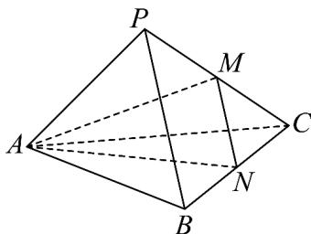

<!-- question-source:start -->
【变式3】如图，三棱锥 $P - ABC$ 的底面是边长为 $^{3}$ 的等边三角形，侧棱 $PA = 3$ ， $PB = 4$ ， $PC = 5$ ， $M,N$ 分

别是 $PC, BC$ 的中点，求直线 $AP$ 与平面 $AMN$ 所成的角。

<!-- question-source:end -->

![[高中/课堂同步/题库/人教A版高中数学同步讲义(2026)/02_必修第二册/第八章 立体几何初步/讲义/专题8_6_空间直线_平面的垂直_高效培优讲义_/题型04_直线与平面所成角_sec_14/questions/answers/Q00065261A1.md]]
