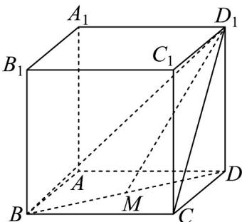
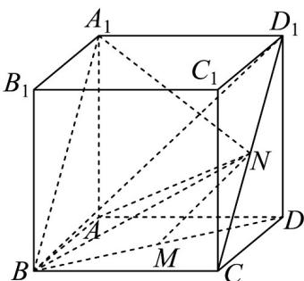
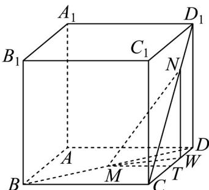
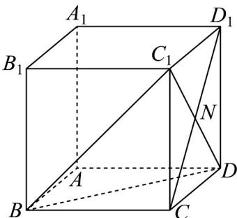
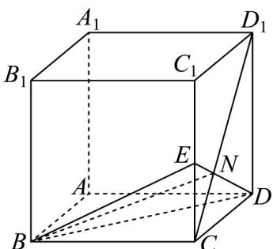
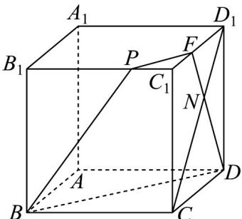

> [!faq]- 《专题8_6_空间直线_平面的垂直_高效培优讲义_》官方解析
>
> > [!success]- **【答案】** CD
>
> > [!note]- **【分析】**
> > $^{A}$ 选项，举出反例可得 $^{A}$ 错误； $^{B}$ 选项，直角 $\triangle BAA_{1}$ 面积为定值，点N到平面 $BAA_{1}$ 的距离为定值，
> >
> > 故体积为定值； $^{C}$ 选项，作出辅助线，得到 $\angle NMW$ 即为直线MN与平面ABCD所成角，设大小为 $\theta$ ，设
> >
> > $NW = m$ ， $0\leq m\leq 2$ ，分 $1\leq m\leq 2$ ， $m = 0$ 和 $0 <   m <   1$ 三种情况，得到 $\tan \theta$ 的取值范围，得到C正确；D选项
> >
> > 当 N 为 $CD_{1}$ 的中点， $CN < ND_{1}$ 和 $CN > ND_{1}$ 三种情况，画出平面 BDN 截得正方体 ABCD - $A_{1}B_{1}C_{1}D_{1}$ 的截面，得到
> >
> > D 正确·
>
> > [!note]- **【解析】**
> > $^{A}$ 选项，当点N与 $D_{1}$ 重合时，如图，
> >
> > 此时 $BD_{1}$ 与 $MD_{1}$ 不垂直，夹角为锐角，A 错误；
> >
> > 
> >
> > B 选项，在点 N 的位置移动时，点 N 到平面 $BAA_{1}$ 的距离为定值，
> >
> > 等于正方体 $ABCD - A_{1}B_{1}C_{1}D_{1}$ 的棱长，且直角 $\triangle BAA_{1}$ 面积为定值，
> >
> > 所以三棱锥 $N-BAA_{1}$ 的体积为定值，不会随着点 N 的位置的改变而变化， $^{B}$ 错误；
> >
> > 
> >
> > $^{C}$ 选项，取 CD 的中点 T，连接 MT，则 $MT_{\perp}CD$ ，过点 N 作 $NW_{\perp}CD$ 于点 W，
> >
> > 则 $NW \parallel DD_{1}$ ，故 $NW \perp$ 平面 ABCD，
> >
> > 所以 $\angle NMW$ 即为直线 $MN$ 与平面 $ABCD$ 所成角，设大小为 $\theta$
> >
> > 设正方体 $ABCD - A_{1}B_{1}C_{1}D_{1}$ 的棱长为 2，则 MT = 1，
> >
> > 设 NW = m ， $0 \leq m \leq 2$
> >
> > 若 $1 \leq m \leq 2$ ，则 $CW = m, WT = m - 1$
> >
> > 
> >
> > 由勾股定理得 $MW = \sqrt{MT^2 + WT^2} = \sqrt{1 + (m - 1)^2} = \sqrt{m^2 - 2m + 2}$
> >
> > 则 $\tan \theta = \frac{WN}{WM} = \frac{m}{\sqrt{m^2 - 2m + 2}} = \frac{1}{\sqrt{\frac{2}{m^2} - \frac{2}{m} + 1}} = \frac{1}{\sqrt{2\left(\frac{1}{m} - \frac{1}{2}\right)^2 + \frac{1}{2}}}$
> >
> > 当 $m = 2$ 时， $\tan \theta$ 取得最大值，最大值为 $\sqrt{2}$
> >
> > 当 $m = 1$ 时， $\tan \theta$ 取得最小值，最小值为 $1$ ，故 $\tan \theta \in [1, \sqrt{2}]$
> >
> > 若 $m = 0$ ，此时 $MN \subset$ 平面 $ABCD$ ，此时夹角为 $0$ ， $\tan \theta = 0$
> >
> > 若 $0 < m < 1$ ，则 $CW = m, WT = 1 - m$
> >
> > 由勾股定理得 $MW = \sqrt{MT^2 + WT^2} = \sqrt{1 + (1 - m)^2} = \sqrt{m^2 - 2m + 2}$
> >
> > $$
> > \tan \theta = \frac {W N}{W M} = \frac {m}{\sqrt {m ^ {2} - 2 m + 2}} = \frac {1}{\sqrt {\frac {2}{m ^ {2}} - \frac {2}{m} + 1}} = \frac {1}{\sqrt {2 \left(\frac {1}{m} - \frac {1}{2}\right) ^ {2} + \frac {1}{2}}} ,
> > $$
> >
> > 显然 $\frac{1}{m} -\frac{1}{2} >\frac{1}{2}$ ， $\sqrt{2\left(\frac{1}{m} - \frac{1}{2}\right)^2 + \frac{1}{2}} >1$ ， $0 <   \frac{1}{\sqrt{2\left(\frac{1}{m} - \frac{1}{2}\right)^2 + \frac{1}{2}}} <  1$
> >
> > 此时 $\tan \theta \in (0,1)$
> >
> > 综上， $\tan \theta \in [0,\sqrt{2} ]$
> >
> > 直线 $MN$ 与平面 $ABCD$ 所成角的正切值的取值范围为 $\left[0, \sqrt{2}\right]$ ， $C$ 正确；
> >
> > D 选项，当 N 为 $CD_{1}$ 的中点时，平面 BDN 截得正方体 $ABCD - A_{1}B_{1}C_{1}D_{1}$ 的截面为正 $\triangle BDC_{1}$
> >
> > 
> >
> > 当 $CN < ND_{1}$ 时，延长 DN 交 $CC_{1}$ 于点 E，连接 BE，则 VBDE 即为平面 BDN 截得正方体 ABCD - A₁B₁C₁D₁ 的截
> >
> > 面，
> >
> > 
> >
> > 当 $CN > ND_{1}$ 时，延长 $DN$ 交 $D_{1}C_{1}$ 于点 $F$ ，
> >
> > 在平面 $A_{1}B_{1}C_{1}D_{1}$ 上，过点 $F$ 作 $FP$ 平行于 $BD$ ，交 $B_{1}C_{1}$ 于点 $P$ ，连接 $BP$
> >
> > 则四边形 BDFP 即为平面 BDN 截得正方体 $ABCD - A_{1}B_{1}C_{1}D_{1}$ 的截面，
> >
> > 
> >
> > 故平面 $BDN$ 截得正方体 $ABCD - A_{1}B_{1}C_{1}D_{1}$ 的截面可能是三角形或四边形， $^{D}$ 正确。
> >
> > 故选 **CD**
