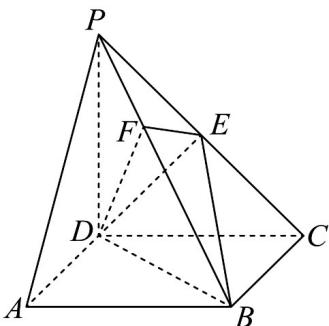

<!-- question-source:start -->
【变式1】如图，在四棱锥 $P - ABCD$ 中， $PD \perp$ 底面 $ABCD$ ， $E$ 是 $PC$ 的中点，点 $F$ 在棱 $BP$ 上，且

$EF \perp BP$ ，四边形 ABCD 为正方形，PD = CD = 2

(1)证明： $BP \perp DF$ ；

(2)求点 $F$ 到平面 $BDE$ 的距离；

(3)求二面角 $F - DE - B$ 的余弦值.
<!-- question-source:end -->

![[高中/课堂同步/题库/人教A版高中数学同步讲义(2026)/02_必修第二册/第八章 立体几何初步/讲义/专题8_6_空间直线_平面的垂直_高效培优讲义_/题型05_空间中的距离问题_sec_15/questions/answers/Q00065262A1.md]]
