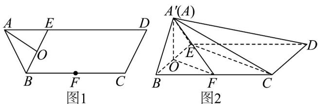

<!-- question-source:start -->
【变式3】如图1，等腰梯形ABCD中， $AD / / BC$ ， $E$ 为 $AD$ 边上一点，且 $AB = AE = BE = CD = 2$

$BC = ED = 4$ ， $O$ 为 $BE$ 中点， $F$ 为 $BC$ 中点将 $\triangle ABE$ 沿 $BE$ 折起到 $\triangle A^{\prime}BE$ 的位置，如图2

(1)证明： $CD \perp$ 平面 $A^{\prime}OF$ ；

(2)若 $A'O \perp OF$ ，求点 $F$ 到平面 $A'EC$ 的距离；

(3)试在线段 $A^{\prime}D$ 上确定一点 $G$ ，使得平面 $GCE / /$ 平面 $A^{\prime}OF$ ，并给出证明.
<!-- question-source:end -->

![[高中/课堂同步/题库/人教A版高中数学同步讲义(2026)/02_必修第二册/第八章 立体几何初步/讲义/专题8_6_空间直线_平面的垂直_高效培优讲义_/题型05_空间中的距离问题_sec_15/questions/answers/Q00065264A1.md]]
