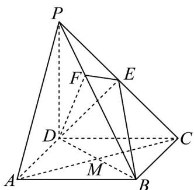

> [!faq]- 《专题8_6_空间直线_平面的垂直_高效培优讲义_》官方解析
>
> > [!success]- **【答案】** (1)证明见解析 $\frac{4\sqrt{3}}{9}$ $\frac{1}{3}$
>
> > [!note]- **【分析】**
> > （1）先证 $DE \perp$ 平面 $PBC$ ，再证 $BP \perp$ 平面 $DEF$ ，即可证 $BP \perp DF$ ；
> >
> > $V_{F-BDE}=V_{E-BDF}=\frac{1}{2}V_{C-BDF}$ 可求；
> >
> > (3) $\angle BEF$ 为二面角 $F - DE - B$ 的平面角，求出 $EF, BE$ ，可求 $\cos \angle BEF$ .
>
> > [!note]- **【解析】**
> > （1）证明：因为 $PD \perp$ 底面 ABCD， $BC \subset$ 底面 ABCD，所以 $PD \perp BC$ ，
> >
> > 因为四边形 ABCD 为正方形，所以 $DC \perp BC$
> >
> > 因为 $PD \cap DC = D$ ， $PD, DC \subset$ 平面 PCD，所以 $BC \perp$ 平面 PCD，
> >
> > 因为 $DE \subset$ 平面 PCD ，所以 $BC \perp DE$
> >
> > 在 $\triangle PCD$ 中，因为 $PD = CD$ ， $E$ 是 $PC$ 的中点，所以 $DE \perp PC$
> >
> > 因为 $BC \cap PC = C$ ，PC, $BC \subset$ 平面 PCB，所以 $DE \perp$ 平面 PBC，
> >
> > 因为 $PB \subset$ 平面 PBC ，所以 $DE \perp PB$
> >
> > 因为 $EF \perp BP, DEI EF = E$ ， $EF, DE \subset$ 平面 $DEF$ ，所以 $BP \perp$ 平面 $DEF$
> >
> > 因为 $DF \subset$ 平面 $DEF$ ，所以 $BP \perp DF$
> >
> > (2) 连接 AC 交 BD 于点 M，如图所示：
> >
> > 
> >
> > 则 $AC \perp BD$ ，又因为 $PD \perp$ 底面 $ABCD$ ， $AC \subset$ 平面 $ABCD$ ，所以 $AC \perp PD$
> >
> > 因为 $PD \cap BD = D$ ， $PD, DB \subset$ 平面 $PBD$ ，所以 $AC \perp$ 平面 $PDB$ ，则点 $C$ 到平面 $PDB$ 的距离为 $\left|CM\right| = \sqrt{2}$
> >
> > 因为 E 是 PC 的中点，所以 $V_{F-BDE} = V_{E-BDF} = \frac{1}{2} V_{C-BDF}$ ，
> >
> > 因为底面正方形 $ABCD$ 边长为 2，所以 $BD = 2\sqrt{2}$ ， $PB = \sqrt{PD^2 + DB^2} = \sqrt{2^2 + (2\sqrt{2})^2} = 2\sqrt{3}$
> >
> > 所以 $DF = \frac{BD \cdot DP}{BP} = \frac{2\sqrt{6}}{3}$ ， $BF = \sqrt{BD^{2} - DF^{2}} = \frac{4\sqrt{3}}{3}$
> >
> > 所以 $S_{\triangle BDF}=\frac{1}{2}BF\cdot DF=\frac{4\sqrt{2}}{3}$
> >
> > $$
> > V _ {C - B D F} = \frac {1}{3} \times \frac {4 \sqrt {2}}{3} \times \sqrt {2} = \frac {8}{9}, \text {所以} V _ {F - B D E} = \frac {4}{9}
> > $$
> >
> > 在VBDE中 $DE = \sqrt{2}, BE = \sqrt{CE^2 + BC^2} = \sqrt{6}, BD = 2\sqrt{2}$ ，满足 $DE^2 + BE^2 = BD^2$ ，有 $DE \perp BE$
> >
> > 所以 $S_{\triangle BDE} = \frac{1}{2} \times DE \times BE = \sqrt{3}$
> >
> > 设点到平面的距离为，由 $V_{F - BDE} = \frac{1}{3}\times S_{BDE}\times h$ 可得 $h = \frac{V_{F - BDE}}{\frac{1}{3}S_{BDE}} = \frac{\frac{4}{9}}{\frac{1}{3}\times\sqrt{3}} = \frac{4\sqrt{3}}{9}$
> >
> > (3) 由 (1) 可得 $DE \perp$ 平面 $PBC$ ，因为 $EF \subset$ 平面 $PBC, EB \subset$ 平面 $PBC$ ，
> >
> > 所以 $DE \perp EF, DE \perp EB$ ，所以 $\angle BEF$ 为二面角 F - DE - B 的平面角，
> >
> > $$
> > P E = \frac {1}{2} P C = \sqrt {2}, B E = \sqrt {C E ^ {2} + B C ^ {2}} = \sqrt {6}
> > $$
> >
> > 因为 $\angle PFE = \angle PCB = 90^{\circ}$ ， $\angle FPE = \angle CPB$ ，所以 $\triangle PFE\sim \triangle PCB$
> >
> > 所以 $\frac{PE}{PB} = \frac{EF}{BC}$ ，解得 $EF = \frac{PE\cdot BC}{PB} = \frac{\sqrt{6}}{3}$
> >
> > 因为 $EF \perp BP$ ，即 $\angle EFB = 90^{\circ}$ ，所以 $\cos \angle BEF = \frac{EF}{BE} = \frac{1}{3}$ ，
> >
> > 故二面角 $F - DE - B$ 的余弦值为 $\frac{1}{3}$
