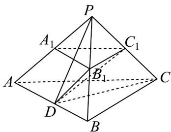

> [!faq]- 《专题8_6_空间直线_平面的垂直_高效培优讲义_》官方解析
>
> > [!success]- **【答案】** A. $DC_{1} \perp CC_{1}$ B．直线 $DC_{1}$ 与 BC 夹角的余弦值为 $\frac{1}{2}$ C. A 到平面 $BCC_{1}B_{1}$ 的距离为 $\frac{4\sqrt{6}}{3}$ D．棱台 $ABC-A_{1}B_{1}C_{1}$ 的体积为 $\frac{14\sqrt{2}}{3}$
>
> > [!note]- **【分析】**
> > 正三棱台 $ABC-A_{1}B_{1}C_{1}$ 补成正四面体 P-ABC ，利用正四面体的几何性质即可求解 AC，根据异面直线
> >
> > 的夹角可知 $\angle DC_{1}B_{1}$ 或其补角为所求，利用三角形边角关系即可求解 B，利用体积公式即可求解 D.
>
> > [!note]- **【解析】**
> > 将正三棱台 $ABC-A_{1}B_{1}C_{1}$ 补成三棱锥 P-ABC ，根据 $AB=2AA_{1}=2A_{1}B_{1}=4$ ，可知
> >
> > $PA = PB = PC = AB = BC = AC = 4$ ，则三棱锥 P - ABC 为正四面体，
> >
> > 对于 $^{A}$ ：由于D为棱AB的中点，故CD=PD，又 $C_{1}$ 是PC的中点，故 $DC_{1}\perp CC_{1}$ ， $^{A}$ 正确，
> >
> > 对于 B, 由于 $BC \parallel B_{1}C_{1}$ ，故 $\angle DC_{1}B_{1}$ 或其补角即为直线 $DC_{1}$ 与 BC 夹角，由于
> >
> > $$
> > B _ {1} C _ {1} = 2, D C _ {1} = \sqrt {C D ^ {2} - C _ {1} C ^ {2}} = \sqrt {\left(4 \times \frac {\sqrt {3}}{2}\right) ^ {2} - 2 ^ {2}} = 2 \sqrt {2}, D B _ {1} = \frac {1}{2} P A = 2,
> > $$
> >
> > 故 $\cos\angle DC_{1}B_{1}=\frac{B_{1}C_{1}^{2}+B_{1}D^{2}-C_{1}D^{2}}{2B_{1}C_{1}\cdot B_{1}D}=\frac{4+4-8}{2\times2\times2}=0$ ，故 B 错误，
> >
> > 对于 C, 三棱锥 $P - ABC$ 的高为 $h = \sqrt{PC^{2} - \left(\frac{2}{3}CD\right)^{2}} = \sqrt{4^{2} - \left(\frac{2}{3} \times \frac{\sqrt{3}}{2} \times 4\right)^{2}} = \frac{4\sqrt{6}}{3}$ ，因此 A 到平面 $BCC_{1}B_{1}$ 的距离为
> >
> > $\frac{4\sqrt{6}}{3}$ , C 正确，
> >
> > 对于 D, 因为 $S_{\triangle ABC} = \frac{1}{2} \times 4 \times 4 \times \frac{\sqrt{3}}{2} = 4\sqrt{3}$ ， $S_{\triangle A_{1}B_{1}C_{1}} = \frac{1}{2} \times 2 \times 2 \times \frac{\sqrt{3}}{2} = \sqrt{3}$
> >
> > 故棱台 $ABC - A_{1}B_{1}C_{1}$ 的体积为 $\frac{1}{3}\left(S_{\triangle ABC} + S_{\triangle A_1B_1C_1} + \sqrt{S_{\triangle ABC} \cdot S_{\triangle A_1B_1C_1}}\right)\frac{1}{2} h = \frac{1}{3}\left(\sqrt{3} + 4\sqrt{3} + 2\sqrt{3}\right) \times \frac{2\sqrt{6}}{3} = \frac{14\sqrt{2}}{3}$ ，D正
> >
> > 确，
> >
> > 故选：ACD
> >
> > 
