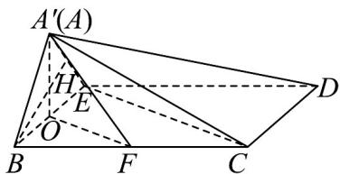
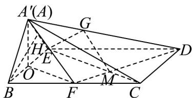

> [!faq]- 《专题8_6_空间直线_平面的垂直_高效培优讲义_》官方解析
>
> > [!success]- **【答案】** (1)证明见解析 (2) $\frac{\sqrt{3}}{2}$ (3)G 为线段 $A^{\prime}D$ 上靠近 $A^{\prime}$ 的三等分点，证明见解析
>
> > [!note]- **【分析】**
> > （1）求证 $BE \perp A'O$ ， $OF \perp BE$ ，再结合线面垂直的判定定理即可；
> >
> > (2) 将问题转化为求点 B 到平面 $A^{\prime}EC$ 的距离，再取 $A^{\prime}E$ 的中点为 H，求证 $BH \perp$ 平面 $A^{\prime}EC$ ，即可求出；
> >
> > $$
> > \frac {A ^ {\prime} G}{G D} = \frac {1}{2}
> > $$
> >
> > (3) 在 $AD$ 上取点 $G$ ，使 $\overline{GD} - \overline{2}$ ，从而 $GM // A'F$ ，再结合 $OF // EC$ ，利用面面平行的判定定理即可求证。
>
> > [!note]- **【解析】**
> > （1）在等腰梯形 ABCD 中， $AD \parallel BC$ ，BC = ED = 4，
> >
> > 则四边形 $BCDE$ 是平行四边形，则 $BE \parallel CD$
> >
> > 因为 $AB = AE = BE = CD = 2$ ，所以 $\triangle ABE$ 为等边三角形，则 $\angle BAE = 60^{\circ}$
> >
> > 因为 O 为 BE 中点，所以 $BE \perp A'O$
> >
> > 在等腰梯形 ABCD 中，可得 $\angle BAE = \angle CDE = \angle CBE = 60^{\circ}$
> >
> > 连接 $EC$ ，在VBEC中，由余弦定理可 $EC^2 = BC^2 + BE^2 - 2BC \cdot BE \cdot \cos \angle EBC = 12$
> >
> > 则 $EC = 2\sqrt{3}$ ，所以 $BE^{2} + EC^{2} = 16 = BC^{2}$ ，则 $BE \perp EC$
> >
> > 因为 O 、 F 分别是 BE 、 BC 中点，所以 OF // EC ，所以 OF ⊥ BE ，
> >
> > 从而可得 $OF \perp CD$ ， $CD \perp A'O$ ，
> >
> > 因为 $A'O \cap OF = O$ ， $A'O$ 、 $OF \subset$ 平面 $A'OF$ ，所以 $CD \perp$ 平面 $A'OF$ ；
> >
> > (2) 由 (1) 可知 $OF \parallel EC$ ，因 $OF \notin$ 平面 $A'EC$ ， $EC \subset$ 平面 $A'EC$ ，则 $OF \parallel$ 平面 $A'EC$
> >
> > 所以点 F 到平面 $A^{\prime}EC$ 的距离即为点 O 到平面 $A^{\prime}EC$ 的距离，
> >
> > 因为 $O$ 是 $BE$ 中点，所以点 $F$ 到平面 $A^{\prime}EC$ 的距离等于点 $B$ 到平面 $A^{\prime}EC$ 的距离的一半.
> >
> > 取 $A^{'}E$ 的中点为 H ，连接 BH ，
> >
> > 因为 $\triangle A^{\prime}BE$ 为等边三角形，所以 $BH\perp A^{\prime}E$ ，
> >
> > 
> >
> > 由（1）知 $EC \perp BE$ ，因为 $A'O \perp OF$ ，而 $OF // EC$ ，则 $EC \perp A'O$
> >
> > 又因为 $BE \cap A'O = O$ ，BE、 $A'O \subset$ 平面 $A'BE$ ，所以 $EC \perp$ 平面 $A'BE$ ，
> >
> > 因为 $BH \subset$ 平面 $A^{\prime}BE$ ，所以 $EC \perp BH$ ，
> >
> > 又因为 $EC \cap A^{'}E = E$ ，EC、 $A^{'}E \subset$ 平面 $A^{'}EC$ ，所以 $BH \perp$ 平面 $A^{'}EC$ ，
> >
> > 因为 $\triangle A^{\prime}BE$ 是等边三角形，边长为 $2$ ，故 $BH = \sqrt{2^2 - 1^2} = \sqrt{3}$
> >
> > 所以点 $B$ 到平面 $A^{\prime}EC$ 的距离为 $\sqrt{3}$
> >
> > $$
> > A ^ {\prime} E C
> > $$
> >
> > $$
> > \frac {\sqrt {3}}{2}
> > $$
> >
> > (3) 设 $DF \cap CE = M$ ，则 $\frac{FM}{MD} = \frac{CF}{ED} = \frac{1}{2}$
> >
> > 在 $AD$ 上取点 $G$ ，使 $\frac{A^{\prime}G}{GD} = \frac{1}{2}$ ，从而 $GM / / A^{\prime}F$
> >
> > 连接 $EG$ ，因为 $A^{\prime}F\not\subset$ 平面 $GEC$ ， $GM\subset$ 平面 $GEC$ ，所以 $A^{\prime}F//$ 平面 $GEC$
> >
> > 
> >
> > 又由（1）可知， $OF//EC$ ， $OF\not\subset$ 平面GEC， $GM\subset$ 平面GEC，
> >
> > 则 $OF \parallel$ 平面 $GEC$ ，
> >
> > 又因为 $A^{\prime}F\cap OF = F$ ， $A^{\prime}F,OF\subset$ 平面 $A^{\prime}OF$ ，所以平面GCE//平面 $A^{\prime}OF$
> >
> > 故 G 为线段 $A^{\prime}D$ 上靠近 $A^{\prime}$ 的三等分点时，平面 $GCE \parallel$ 平面 $A^{\prime}OF$
