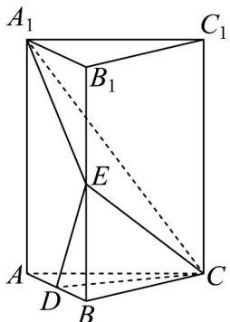
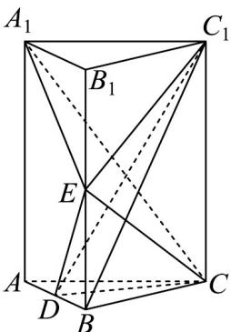

## 题型05 空间中的距离问题

【典例1】如图，在正三棱柱 $ABC - A_{1}B_{1}C_{1}$ 中， $D, E$ 分别为 $AB, BB_{1}$ 的中点， $AB = 2, AA_{1} = 2\sqrt{2}$

(1)证明： $CD \perp A_{1}E$ ；

(2)证明：平面 $A_{1}CE \perp$ 平面 $CDE$ ；

(3)求点 $C_1$ 到平面 $CDE$ 的距离.

【答案】(1)证明见解析

(2)证明见解析

$$
2 \sqrt {6}
$$

(3) $\overline{3}$

【分析】（ $^{1}$ ）根据正三棱柱的结构特点证明线面垂直，进而得到线线垂直·

（2）根据棱柱的长度，先证 $A_{1}E \perp DE$ ，结合（1）的结论，可证 $A_{1}E \perp$ 平面 $CDE$ ，进而根据面面垂直的判定

定理证明面面垂直·

(3) 利用体积法求点到平面的距离.

【详解】（1）因为三棱柱 $ABC-A_{1}B_{1}C_{1}$ 为正三棱柱，所以平面 $ABC \perp$ 平面 $ABB_{1}A_{1}$

又 VABC 为正三角形，D 为 AB 中点，所以 $CD \perp AB$ .

又平面 $ABC \cap$ 平面 $ABB_{1}A_{1} = AB$ ， $CD \subset$ 平面 ABC，

所以 $CD \perp$ 平面 $ABB_{1}A_{1}$ .

因为 $A_{1}E \subset$ 平面 $ABB_{1}A_{1}$ ，所以 $CD \perp A_{1}E$ 。

(2) 因为 AB = 2， $AA_{1} = 2\sqrt{2}$ ，D, E 分别为 $AB, BB_{1}$ 的中点，

所以 $\tan \angle DEB = \frac{\sqrt{2}}{2}$ ， $\tan \angle EA_{1}B_{1} = \frac{\sqrt{2}}{2}$ ，所以 $\angle DEB = \angle EA_{1}B_{1}$

所以 $\angle DEB + \angle A_{1}EB_{1} = \angle EA_{1}B_{1} + \angle A_{1}EB = \frac{\pi}{2}$ ，所以 $A_{1}E\perp DE$

又 $CD \perp A_{1}E$ ， $CD, DE \subset$ 平面 $CDE$ ， $CD \cap DE = D$ ，所以 $A_{1}E \perp$ 平面 $CDE$ ：

又 $A_{1}E \subset$ 平面 $A_{1}CE$ ，所以平面 $A_{1}CE \perp$ 平面 $CDE$ .

(3) 如图：

设点 $C_{1}$ 到平面 CDE 的距离为 h·则 $V_{C_{1}-CDE} = \frac{1}{3} S_{\triangle CDE} \cdot h$

$$
V _ {C _ {1} - C D E} = V _ {D - C _ {1} E C} = V _ {D - C _ {1} B C} = V _ {C _ {1} - B C D} = \frac {1}{3} \times \frac {1}{2} S _ {\triangle A B C} \cdot C C _ {1} = \frac {1}{3} \times \frac {1}{2} \times \sqrt {3} \times 2 \sqrt {2} = \frac {\sqrt {6}}{3}.
$$

在 $\triangle CDE$ 中， $CD \perp DE$ ， $CD = \sqrt{3}$ ， $DE = \sqrt{3}$ ，所以 $S_{\triangle CDE} = \frac{3}{2} \cdot$ 所以 $\frac{\sqrt{6}}{3} = \frac{1}{3} \times \frac{3}{2} \cdot h \Rightarrow h = \frac{2\sqrt{6}}{3}$ 。

## 方法技巧

## 空间中距离的转化

(1) 利用线面、面面平行转化：利用线面距、面面距的定义，转化为直线或平面上的另一点到平面的距离。

（2）利用中点转化：如果条件中具有中点条件，将一个点到平面的距离，借助中点（等分点），转化为另一

点到平面的距离.

（3）通过换底转化：一是直接换底，以方便求几何体的高；二是将底面扩展（分割），以方便求底面积和高。

![[高中/课堂同步/题库/人教A版高中数学同步讲义(2026)/02_必修第二册/第八章 立体几何初步/讲义/专题8_6_空间直线_平面的垂直_高效培优讲义_/题型05_空间中的距离问题_sec_15/questions/Q00065262.md]]
![[高中/课堂同步/题库/人教A版高中数学同步讲义(2026)/02_必修第二册/第八章 立体几何初步/讲义/专题8_6_空间直线_平面的垂直_高效培优讲义_/题型05_空间中的距离问题_sec_15/questions/Q00065263.md]]
![[高中/课堂同步/题库/人教A版高中数学同步讲义(2026)/02_必修第二册/第八章 立体几何初步/讲义/专题8_6_空间直线_平面的垂直_高效培优讲义_/题型05_空间中的距离问题_sec_15/questions/Q00065264.md]]
