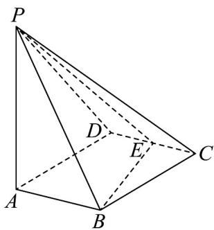

<!-- question-source:start -->
【变式2】如图所示，四棱锥 $P - ABCD$ 的底面ABCD是边长为1的菱形， $\angle BCD = 60^{\circ}$ ， $E$ 是 $CD$ 的中点，

$PA \perp$ 底面 ABCD，PA = 2。

(1)证明：平面 $PBE \perp$ 平面 $PAB$ ；

(2)求点 D 到平面 PBE 的距离.
<!-- question-source:end -->

![[高中/课堂同步/题库/人教A版高中数学同步讲义(2026)/02_必修第二册/第八章 立体几何初步/讲义/专题8_6_空间直线_平面的垂直_高效培优讲义_/题型06_面面垂直判定定理的应用_sec_16/questions/answers/Q00065266A1.md]]
