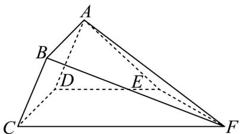

<!-- question-source:start -->
【变式3】如图，多面体 $ABCDEF$ 中，四边形 $ABCD$ 为矩形， $\angle ADE = 60^{\circ}$ ， $DE // CF$ ， $CD \perp DE$ ， $AD = 2$

$$
D C = 3 \quad D E = 4 \quad C F = 5
$$

(1)求证：平面 $ABCD \perp$ 平面 $ADE$ ；

(2)求直线 $BD$ 与平面 $CDEF$ 所成角的正弦值；

(3)求点 F 到平面 ABCD 的距离.
<!-- question-source:end -->

![[高中/课堂同步/题库/人教A版高中数学同步讲义(2026)/02_必修第二册/第八章 立体几何初步/讲义/专题8_6_空间直线_平面的垂直_高效培优讲义_/题型06_面面垂直判定定理的应用_sec_16/questions/answers/Q00065267A1.md]]
