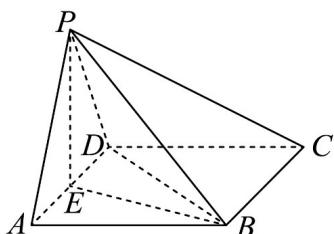

> [!faq]- 《专题8_6_空间直线_平面的垂直_高效培优讲义_》官方解析
>
> > [!success]- **【答案】** (1)证明见解析 (2) $\frac{4\sqrt{15}}{5}$
>
> > [!note]- **【分析】**
> > （1）根据边长关系得出 $PE \perp AD$ 及 $PE \perp BE$ ，再应用线面垂直判定定理证明 $PE \perp$ 平面ABCD，最
> >
> > 后应用面面垂直判定定理证明即可；
> >
> > (2) 应用三棱锥体积公式应用等体积计算点到平面距离即可.
>
> > [!note]- **【解析】**
> > （1）证明：取棱 $AD$ 的中点 $E$ ，连接 $PE, BE$ ：
> >
> > 因为四边形 $ABCD$ 是菱形， $PE, BE AB = 4, \angle BAD = 60^{\circ}$ ，所以 $AB = BD = 4$ 。
> >
> > 因为 $E$ 是棱 $AD$ 的中点，所以 $BE \perp AD, AE = \frac{1}{2} AD = 2$ ，则 $BE = 2\sqrt{3}$ 。
> >
> > 因为 $\triangle PAD$ 为等边三角形，且 $AD = 4$ ， $E$ 是棱 $AD$ 的中点，所以 $PE \perp AD, PE = 2\sqrt{3}$
> >
> > 因为 $PB = 2\sqrt{6}$ ，所以 $BE^{2} + PE^{2} = PB^{2}$ ，所以 $PE \perp BE$ 。
> >
> > 因为 $BE \subset$ 平面 $ABCD$ ， $AD \subset$ 平面 $ABCD$ ，且 $BE \cap AD = E$ ，所以 $PE \perp$ 平面 $ABCD$ 。
> >
> > 因为 $PE \subset$ 平面 PAD ，所以平面 $PAD \perp$ 平面 ABCD
> >
> > (2) 因为 $AB = AD = 4, \angle BAD = 60^\circ$ ，所以 $\triangle ABD$ 的面积 $S_1 = \frac{1}{2} \times 4 \times 4 \times \frac{\sqrt{3}}{2} = 4\sqrt{3}$
> >
> > 由（1）可知 $PE \perp$ 平面 $ABCD$ ，且 $PE = 2\sqrt{3}$ ，则三棱锥 $P - ABD$ 的体积 $V_{1} = \frac{1}{3} S_{1} \cdot PE = 8$
> >
> > 因为 $BD = PD = 4, PB = 2\sqrt{6}$ ，所以 $\triangle PBD$ 的面积 $S_{2} = \frac{1}{2} \times 2\sqrt{6} \times \sqrt{16 - 6} = 2\sqrt{15}$
> >
> > 设点 $A$ 到平面PBD的距离为 $d$ ，则三棱锥 $A - PBD$ 的体积 $V_{2} = \frac{1}{3} S_{2}d = \frac{2\sqrt{15}}{3} d$
> >
> > 因为 $V_{1} = V_{2}$ ，所以 $8 = \frac{2\sqrt{15}}{3} d$
> >
> > 解得 $d = \frac{4\sqrt{15}}{5}$ ，即点 $A$ 到平面PBD的距离为 $\frac{4\sqrt{15}}{5}$
> >
> > 
