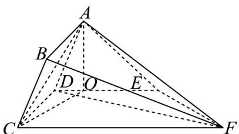

> [!faq]- 《专题8_6_空间直线_平面的垂直_高效培优讲义_》官方解析
>
> > [!success]- **【答案】** (1)证明见解析 (2) $\frac{\sqrt{39}}{13}$ (3) $\frac{5\sqrt{3}}{2}$
>
> > [!note]- **【分析】**
> > （1）根据条件有 $CD \perp AD$ ， $CD \perp DE$ ，利用线面垂直的判定定理，得到 $CD \perp$ 平面 $ADE$ ，再由面
> >
> > 面垂直的判定定理，即可求解；
> >
> > (2) 作 $AO \perp DE$ 于 $O$ ，根据条件可得 $AO \perp$ 平面 $CDEF$ ，再利用 $AB // CD$ ，可得点 $B$ 到平面 $DCFE$ 的距离。
> >
> > 由线面角的定义，即可求解；
> >
> > (3) 利用等体积法，即可求解·
>
> > [!note]- **【解析】**
> > $(1) \because CD \perp AD, CD \perp DE,$
> >
> > 又 $AD \cap DE = D$ ， $AD$ ， $DE \subset$ 平面 $ADE$ ，
> >
> > $\therefore CD \perp$ 平面 ADE ，
> >
> > $\because CD \subset$ 平面 $ABCD$ ， $\therefore$ 平面 $ABCD \perp$ 平面 $ADE$ .
> >
> > (2) 作 $AO \perp DE$ 于 $O$ ，因为 $AO \subset$ 平面 $ADE$ ，
> >
> > 由（1）知 $CD \perp$ 平面 $ADE$ ，所以 $CD \perp AO$ ，
> >
> > 又 $CD \cap DE = D$ ， $CD$ 、 $DE \subset$ 平面 $CDEF$
> >
> > 所以 $AO \perp$ 平面 CDEF ，连结 CO ，
> >
> > ∵ AB // CD，∴ 点 A 到平面 DCFE 的距离等于点 B 到平面 DCFE 的距离，
> >
> > 设直线 BD 与平面 DCFE 所成角为 $\theta$ ，
> >
> > 又 $\left|BD\right|=\sqrt{4+9}=\sqrt{13}$ ， $\left|AO\right|=\left|AD\right|\sin\frac{\pi}{3}=\sqrt{3}$ ，
> >
> > 所以 $\sin \theta = \frac{|AO|}{|BD|} = \frac{\sqrt{3}}{\sqrt{13}} = \frac{\sqrt{39}}{13}$
> >
> > 故直线 $BD$ 与平面 $CDEF$ 所成角的正弦值为 $\frac{\sqrt{39}}{13}$
> >
> > 
> >
> > (3) 由 (2) 知 $AO \perp$ 平面 $CDEF$ ，设点 $F$ 到平面 $ABCD$ 的距离为 $d$
> >
> > 又 $V_{F - ACD} = V_{A - CDF}$ ，则 $\frac{1}{3} S_{\triangle ACD}\cdot d = \frac{1}{3} S_{\triangle CDF}\cdot |AO|$ ，得到 $d = \frac{S_{\triangle CDF}\cdot|AO|}{S_{\triangle ACD}}$
> >
> > 又 $S_{\triangle CDF} = \frac{1}{2}\left|CD\right|\cdot \left|CF\right| = \frac{15}{2}, S_{\triangle ACD} = \frac{1}{2}\left|CD\right|\cdot \left|DA\right| = 3,$ $AO = \sqrt{3}$
> >
> > 所以 $d=\frac{\frac{15}{2}\times\sqrt{3}}{3}=\frac{5\sqrt{3}}{2}$
