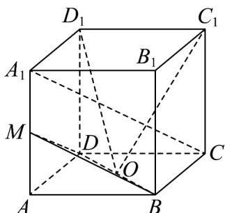
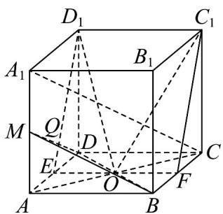
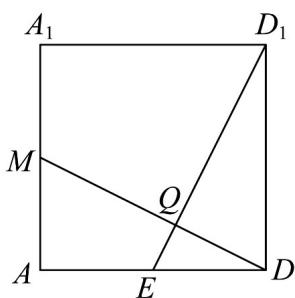

## 题型06 面面垂直判定定理的应用

【典例1】如图，在棱长为 $2$ 的正方体 $ABCD - A_{1}B_{1}C_{1}D_{1}$ 中， $M$ 为棱 $AA_{1}$ 的中点， $O$ 为 $BD$ 的中点。

(1)证明： $A_{1}C / /$ 平面MBD；

(2)求点 $C$ 到平面MBD的距离；

(3)证明：平面 $MBD \perp$ 平面 $OC_{1}D_{1}$

【答案】(1)见解析

(2) $\frac{\sqrt{6}}{3}$

(3)见解析

【分析】（1）由题意先证得 $MO//A_{1}C$ ，再由线面平行的判定定理即可证明；

(2) 由等体积法可得 $V_{C-MBD} = V_{M-CBD}$ ，再由棱锥的体积公式即可得出答案；

(3) 取 $AD, BC$ 的中点为 $E, F$ ，由 $EF // C_1 D_1$ ，则平面 $OC_1 D_1$ 即为平面 $EFC_1 D_1$ ，先证得 $C_1 D_1 \perp MD$

$ED_{1} \perp MD$ ，再由线面垂直的判定定理可证得 $MD \perp$ 平面 $OC_{1}D_{1}$ ，最后由面面垂直的判定定理即可证明平面

$$
M B D \perp_ {\text {平面}} O C _ {1} D _ {1}
$$

【详解】（1）连接 $MO, AC$ ，因为四边形ABCD为正方形，O为BD的中点，

所以 $AC$ 过点 $O$ ，且 $O$ 为 $AC$ 的中点，

在 $\triangle A_{1}AC$ 中，O,M 分别为 AC, $AA_{1}$ 的中点，

所以 $MO \parallel A_{1}C$ ， $A_{1}C \not\subset$ 平面 MBD， $MO \subset$ 平面 MBD，

所以 $A_{1}C \parallel$ 平面 MBD·

(2) 因为 $BD = \sqrt{BA^{2} + AD^{2}} = \sqrt{2^{2} + 2^{2}} = 2\sqrt{2}$

因为 $AA_{1} \perp$ 底面 ABCD ，

$AB, AD \subset \text{底面} ABCD$ ，所以 $AA_{1} \perp AD, AA_{1} \perp AB$

所以 $MB = MD = \sqrt{MA^{2} + AD^{2}} = \sqrt{1^{2} + 2^{2}} = \sqrt{5}$

所以 $S_{\triangle MBD} = \frac{1}{2}\times 2\sqrt{2}\times \sqrt{\left(\sqrt{5}\right)^2 - \left(\frac{2\sqrt{2}}{2}\right)^2} = \frac{1}{2}\times 2\sqrt{2}\times \sqrt{3} = \sqrt{6}$

$$
S _ {\triangle C B D} = \frac {1}{2} \times 2 \times 2 = 2
$$

设点 C 到平面 MBD 的距离为 d，因为 $V_{C-MBD} = V_{M-CBD}$ ，

所以 $\frac{1}{3}S_{\triangle MBD}\cdot d=\frac{1}{3}S_{\triangle CBD}\cdot MA$ ，所以 $\sqrt{6}\cdot d=2\cdot1$ ，所以 $d=\frac{\sqrt{6}}{3}$

所以点 C 到平面 MBD 的距离为 $\frac{\sqrt{6}}{3}$ .

(3) 取 AD, BC 的中点为 E, F，连接 EF， $C_{1}F$ ，连接 $D_{1}E$ 与 MD 交于点 Q，

由正方体的性质可得 $EF / / C_1D_1$ ，所以 $E,F,C_1,D_1,O$ 五点共面，

所以平面 $OC_{1}D_{1}$ 即为平面 $EFC_{1}D_{1}$

又由正方体的性质可得 $C_{1}D_{1} \perp$ 平面 $ADD_{1}A_{1}$ ， $MD \subset$ 平面 $ADD_{1}A_{1}$ ，

所以 $C_1D_1 \perp MD$ ，在三角形 $D_1ED$ 中， $\tan \angle D_1ED = \frac{DD_1}{ED} = 2, \tan \angle AMD = \frac{AD}{MA} = 2$ ，

所以 $\angle D_{1}ED = \angle AMD$ ，又因为 $\angle MDA + \angle AMD = 90^{\circ}$ ，所以 $\angle MDA + \angle D_{1}ED = 90^{\circ}$

所以在三角形 $QED$ ， $\angle EQD = 90^{\circ}$ ，所以 $ED_{1} \perp MD$

$ED_{1},C_{1}D_{1}\subset\limits_{平面}OC_{1}D_{1},ED_{1}\cap C_{1}D_{1}=D_{1}$ ，所以 $MD\perp$ 平面 $OC_{1}D_{1}$

又因为 $MD \subset$ 平面 MBD ，所以平面 $MBD \perp$ 平面 $OC_{1}D_{1}$

## 方法技巧

判定两个平面垂直的常用方法

(1) 定义法：即说明两个平面所成的二面角是直二面角；

(2) 判定定理法：其关键是在其中一个平面内寻找一直线与另一个平面垂直，即把问题转化为“线面垂直”；

（3）性质法：两个平行平面中的一个垂直于第三个平面，则另一个也垂直于此平面。

![[高中/课堂同步/题库/人教A版高中数学同步讲义(2026)/02_必修第二册/第八章 立体几何初步/讲义/专题8_6_空间直线_平面的垂直_高效培优讲义_/题型06_面面垂直判定定理的应用_sec_16/questions/Q00065265.md]]
![[高中/课堂同步/题库/人教A版高中数学同步讲义(2026)/02_必修第二册/第八章 立体几何初步/讲义/专题8_6_空间直线_平面的垂直_高效培优讲义_/题型06_面面垂直判定定理的应用_sec_16/questions/Q00065266.md]]
![[高中/课堂同步/题库/人教A版高中数学同步讲义(2026)/02_必修第二册/第八章 立体几何初步/讲义/专题8_6_空间直线_平面的垂直_高效培优讲义_/题型06_面面垂直判定定理的应用_sec_16/questions/Q00065267.md]]
