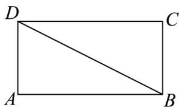
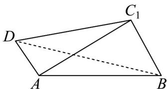

<!-- question-source:start -->
【变式1】如图甲，在矩形ABCD中， $AB = 2$ ， $AD = 1$ ，将 $\triangle BCD$ 沿 $BD$ 翻折至 $\triangle BC_1D$ ，且 $AC_{1} = \sqrt{3}$ ，如图

乙所示·

图1

图2

在图乙中：

(1)求证：平面 $ABC_{1}\perp$ 平面ABD；

(2)求点 A 到平面 $BDC_{1}$ 的距离 d；

(3)求二面角 $C_1 - BD - A$ 的余弦值.
<!-- question-source:end -->

![[高中/课堂同步/题库/人教A版高中数学同步讲义(2026)/02_必修第二册/第八章 立体几何初步/讲义/专题8_6_空间直线_平面的垂直_高效培优讲义_/题型07_求二面角_sec_17/questions/answers/Q00065268A1.md]]
