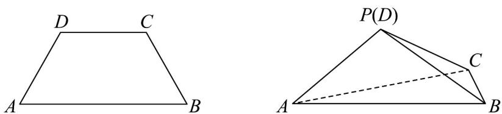

<!-- question-source:start -->
【变式3】如图，在等腰梯形ABCD中， $AB \parallel CD, AB = 2CD = 2AD = 2$ ， $\angle ABC = 60^{\circ}$ ·将 $\Delta ACD$ 沿着AC翻折。

使得点 D 到点 P，且 $AP \perp BC$ .

(1)求证：平面 $APC \perp$ 平面ABC；

(2)求二面角 $P - AB - C$ 平面角的正切值；

(3)求点 C 到平面 APB 的距离.
<!-- question-source:end -->

![[高中/课堂同步/题库/人教A版高中数学同步讲义(2026)/02_必修第二册/第八章 立体几何初步/讲义/专题8_6_空间直线_平面的垂直_高效培优讲义_/题型07_求二面角_sec_17/questions/answers/Q00065270A1.md]]
