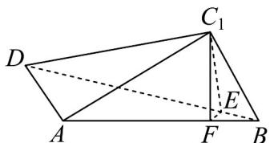

> [!faq]- 《专题8_6_空间直线_平面的垂直_高效培优讲义_》官方解析
>
> > [!success]- **【答案】** (1)证明见解析 (2) $\frac{\sqrt{3}}{2}$ (3) $\frac{1}{4}$
>
> > [!note]- **【分析】**
> > （1）根据勾股定理的逆定理得 $AD \perp AC_{1}$ ，根据线面垂直的性质定理得 $AD \perp$ 平面 $ABC_{1}$ ，，然后根
> >
> > 据面面垂直的判定定理证明即可；
> >
> > (2) 结合等体积法，利用锥体的体积求高即可；
> >
> > (3) 根据二面角平面角的定义作出二面角，然后利用直角三角形的性质求解即可.
>
> > [!note]- **【解析】**
> > （1）由矩形ABCD可知， $DC_{1}=AB=2,BC_{1}=AD=1$ ，又 $AC_{1}=\sqrt{3}$
> >
> > 所以 $AD^{2} + AC_{1}^{2} = 1 + 3 = 4 = DC_{1}^{2}$ ，所以 $AD\perp AC_{1}$
> >
> > 又 $AD \perp AB$ ， $AB \cap AC_{1} = A$ ， $AB, AC_{1} \subset$ 平面 $ABC_{1}$ ，
> >
> > 所以 $AD \perp$ 平面 $ABC_{1}$ ，又 $AD \subset$ 平面 ABD，所以平面 $ABD \perp$ 平面 $ABC_{1}$ ；
> >
> > (2) 由 $BC_{1}^{2} + AC_{1}^{2} = AB^{2}$ ，可得 $AC_{1} \perp BC_{1}$
> >
> > 由（1）知 $AD \perp$ 平面 $ABC_{1}$ ，所以 $V_{D - ABC_{1}} = \frac{1}{3} \times \frac{1}{2} \times AC_{1} \times BC_{1} \times AD = \frac{1}{3} \times \frac{1}{2} \times 1 \times \sqrt{3} \times 1 = \frac{\sqrt{3}}{6}$
> >
> > 又 $V_{D - ABC_1} = V_{A - DBC_1}$ ，所以 $V_{D - ABC_1} = V_{A - DBC_1} = \frac{1}{3}\times \frac{1}{2}\times DC_1\times BC_1\times d = \frac{1}{3} d$ ，所以 $\frac{1}{3} d = \frac{\sqrt{3}}{6}$ ，解得 $d = \frac{\sqrt{3}}{2}$
> >
> > (3) 在平面 $C_{1}BD$ 内作 $C_{1}E \perp BD$ ，垂足为 E；在平面 $ABC_{1}$ 内作 $C_{1}F \perp AB$ ，垂足为 F，连接 EF，
> >
> > 
> >
> > 由 $AD \perp$ 平面 $ABC_{1}$ ， $C_{1}F \subset$ 平面 $ABC_{1}$ ，故 $AD \perp C_{1}F$ ，
> >
> > 因为 $C_{1}F \perp AB$ ， $AB \cap AD = A$ ， $AB, AD \subset$ 平面 ABD，所以 $C_{1}F \perp$ 平面 ABD，
> >
> > 又 $S_{\mathrm{VABC_1}} = \frac{1}{2} AC_1\times BC_1 = \frac{1}{2} AB\times C_1F$ ，所以 $\frac{1}{2}\times \sqrt{3}\times 1 = \frac{1}{2}\times 2\times C_1F$ ，解得 $C_1F = \frac{\sqrt{3}}{2}$
> >
> > 又 $BD \subset$ 平面 ABD ，所以 $C_{1}F \perp BD$ ，又 $C_{1}E \perp BD$
> >
> > $C_{1}E\cap C_{1}F = C_{1}$ ， $C_1E,C_1F\subset$ 平面 $C_1EF$ ，所以 $BD\bot$ 平面 $C_1EF$
> >
> > 又 $EF \subset$ 平面 $C_{1}EF$ ，所以 $BD \perp EF$ ，又 $C_{1}E \perp BD$ ，
> >
> > 所以 $\angle C_{1}EF$ 为二面角 $C_1 - BD - A$ 的平面角，又 $EF\subset$ 平面 $ABD$ ，故 $C_1F\perp EF$ ，所以 $\cos \angle C_1EF = \frac{EF}{C_1E}$
> >
> > 由题意知直角三角形 $C_1BD$ 中， $BD = \sqrt{2^2 + 1^2} = \sqrt{5}$ ， $\sin \angle C_1BD = \frac{DC_1}{DB} = \frac{2}{\sqrt{5}}$
> >
> > 故 $C_{1}E = BC_{1}\cdot \sin \angle DBC_{1} = \frac{2\sqrt{5}}{5}$ ，又 $C_1F = \frac{\sqrt{3}}{2}$ ，则 $EF = \sqrt{C_1E^2 - C_1F^2} = \frac{\sqrt{5}}{10}$
> >
> > 所以 $\cos C_{1}EF = \frac{EF}{C_{1}E} = \frac{\frac{\sqrt{5}}{10}}{\frac{2\sqrt{5}}{5}} = \frac{1}{4}$ ，故二面角 $C_{1} - BD - A$ 的余弦值 $\frac{1}{4}$ .
