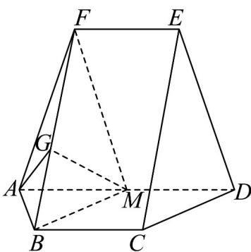
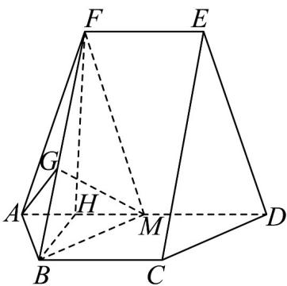

> [!faq]- 《专题8_6_空间直线_平面的垂直_高效培优讲义_》官方解析
>
> > [!success]- **【答案】** (1)证明见解析 (2) $\frac{2\sqrt{2}}{3}$ (3) $\frac{2\sqrt{6}}{3}$
>
> > [!note]- **【分析】**
> > （1）通过证明平面 BMF 内的两条相交直线分别平行于平面 CDE，然后根据平面与平面平行的判定
> >
> > 定理进行证明；
> >
> > (2) 过点 A 作 $AG \perp BF$ 交 BF 于点 G，利用三角形全等证明 $\angle AGM$ 或其补角即为平面 ABF 与平面 BMF 所成
> >
> > 角的平面角，等面积法求出 AG，再利用余弦定理求出 $\cos\angle AGM$ ，即可求出 $\sin\angle AGM$ ；
> >
> > (3) 取 $AM$ 的中点为 $H$ ，连接 $BH$ 、 $FH$ ，首先证明 $FH \perp$ 平面 $ABM$ ，然后利用等体积法求点 $M$ 到平面 $ABF$ 的
> >
> > 距离·
>
> > [!note]- **【解析】**
> > （1）因为 AD = 4 且 M 为 AD 的中点，所以 MD = 2，
> >
> > 因为 $BC \parallel MD, BC = MD$ ，所以四边形 BCDM 是平行四边形，则 BM // CD，
> >
> > 因为 $BM \notin$ 平面 $CDE$ , $CD \subset$ 平面 $CDE$ , 所以 $BM //$ 平面 $CDE$ ,
> >
> > 同理可得 $MF \parallel$ 平面 CDE，
> >
> > 又因为 $BM \cap MF = M, BM, MF \subset$ 平面 $BMF$ ，所以平面 $BMF //$ 平面 $CDE$ .
> >
> > (2) 由 (1) 知平面 $ABF$ 与平面 $CDE$ 所成角即为平面 $ABF$ 与平面 $BMF$ 所成角，过点 $A$ 作 $AG \perp BF$ 交 $BF$ 于
> >
> > 点 G，连接 MG，
> >
> > 
> >
> > 易知 $\triangle ABF \cong \triangle MBF$ ，所以 $MG \perp BF$ ，则 $\angle AGM$ 或其补角即为平面 $ABF$ 与平面 $BMF$ 所成角的平面角，
> >
> > 在 $\triangle ABF$ 中由余弦定理得 $\cos \angle BAF = \frac{AB^2 + AF^2 - BF^2}{2AB\cdot AF} = \frac{\sqrt{7}}{14}$
> >
> > 则 $\sin \angle BAF = \sqrt{1 - \cos^2\angle BAF} = \frac{3\sqrt{21}}{14}$
> >
> > 因为 $S_{\triangle ABF} = \frac{1}{2} \times 2\sqrt{7} \times \frac{3\sqrt{21}}{14} = \frac{1}{2} \times 3AG$ ，解得 $AG = \sqrt{3}$
> >
> > 在 $\triangle AGM$ 中，由余弦定理得 $\cos \angle AGM = \frac{AG^2 + GM^2 - AM^2}{2AG\cdot GM} = \frac{3 + 3 - 4}{2\times 3} = \frac{1}{3}$
> >
> > 所以平面 $ABF$ 与平面 $CDE$ 所成角的正弦值为 $\sqrt{1 - \left(\frac{1}{3}\right)^2} = \frac{2\sqrt{2}}{3}$ .
> >
> > (3) 取 AM 的中点为 H，连接 BH、FH，
> >
> > 
> >
> > 因为 $\triangle AFM$ 为等腰三角形、 $\triangle ABM$ 为等边三角形，所以 $FH \perp AM, BH \perp AM$
> >
> > 所以 $BH = \sqrt{BM^{2} - MH^{2}} = \sqrt{3}$ ， $FH = \sqrt{FM^{2} - HM^{2}} = \sqrt{6}$
> >
> > 因为 $BH^{2} + FH^{2} = BF^{2}$ ，所以 $\angle FHB = \frac{\pi}{2}$ ， $FH \perp BH$ ，
> >
> > 因为 $FH \perp BH$ ， $FH \perp AM$ ， $BH \cap AM = H$ ， $BH, AM \subset$ 平面 ABM，
> >
> > 所以 $FH \perp$ 平面 ABM，
> >
> > 设点 M 到平面 ABF 的距离为 h，
> >
> > $$
> > V _ {F - A B M} = \frac {1}{3} S _ {\triangle A B M} \cdot F H = \frac {1}{3} S _ {\triangle A B F} \cdot h \Rightarrow h = \frac {S _ {\triangle A B M} \cdot F H}{S _ {\triangle A B F}} = \frac {\frac {1}{2} \times 2 \times \sqrt {3} \times \sqrt {6}}{\frac {1}{2} \times 3 \sqrt {3}} = \frac {2 \sqrt {6}}{3},
> > $$
> >
> > 所以点 M 到平面 ABF 的距离为 3
> >
> > $$
> > \frac {2 \sqrt {6}}{3}
> > $$
