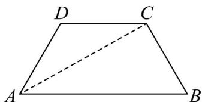
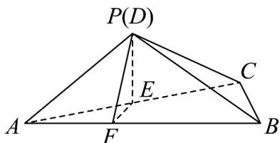

> [!faq]- 《专题8_6_空间直线_平面的垂直_高效培优讲义_》官方解析
>
> > [!success]- **【答案】** (1)证明见解析 (2) $\frac{2\sqrt{3}}{3}$ (3) $\frac{\sqrt{21}}{7}$
>
> > [!note]- **【分析】**
> > （1）要证明面面垂直，可通过线面垂直推导出面面垂直，即证明 $BC \perp$ 平面 $APC$ 即可·
> >
> > (2) 首先作适当的辅助线，根据线面垂直找出二面角 P-AB-C 的平面角，然后根据边角关系求出正切值.
> >
> > (3) 根据等体积法， $V_{P-ABC}=V_{C-APB}$ ，即可求出点 C 到平面 APB 的距离.
>
> > [!note]- **【解析】**
> > （1）证明：
> >
> > 
> >
> > 连接 AC ，根据余弦定理 $AC^{2}=1^{2}+2^{2}-2\cdot1\cdot2\cos60^{\circ}=3$
> >
> > $$
> > \therefore A C = \sqrt {3}, A C ^ {2} + B C ^ {2} = A B ^ {2}, \therefore A C \perp B C
> > $$
> >
> > 又已知 $AP \perp BC$ ， $AP \cap AC = A, AP, AC \subset$ 平面 $PAC$
> >
> > $\therefore BC \perp$ 平面 APC， $\because BC \subset$ 平面 ABC，
> >
> > ∴平面 $APC \perp$ 平面 ABC；
> >
> > (2)
> >
> > 
> >
> > 由（1）知平面 $APC \perp$ 平面 $ABC$ ，平面 $APC \cap$ 平面 $ABC = AC$
> >
> > 作 $PE \perp AC$ 于（AC 中点）E，则 $PE \perp$ 平面 ABC，
> >
> > 作 $EF \perp AB$ 于 $F$ ，连接 $PF$ ，因为 $AB \perp PE, PE \cap EF = E, PE, EF \subset$ 平面 $PEF$ ，
> >
> > 所以 $AB \perp$ 平面 PEF ，
> >
> > $\therefore AB \perp PF$ ，所以 $\angle PFE$ 为二面角 $P - AB - C$ 的平面角，
> >
> > 因为 $AE = EC = \frac{\sqrt{3}}{2}, EF = AE\sin 30^{\circ} = \frac{\sqrt{3}}{4}, PE = \sqrt{1 - \frac{3}{4}} = \frac{1}{2}$
> >
> > $\therefore \tan \angle PFE = \frac{PE}{EF} = \frac{2\sqrt{3}}{3}$
> >
> > 所以二面角 $P - AB - C$ 平面角的正切值为 $\frac{2\sqrt{3}}{3}$
> >
> > (3) 记点 C 到平面 APB 的距离为 d，
> >
> > $$
> > \begin{array}{l} \therefore \\ V _ {C - A P B} = V _ {P - A B C} \end{array} , \therefore d = P E \square \frac {S _ {\triangle A B C}}{S _ {\triangle A P B}} = \frac {1}{2} \square \frac {\frac {1}{2} \square 1 \square \sqrt {3}}{\frac {1}{2} \square 2 \square P F},
> > $$
> >
> > 由（2）知 $PE = \frac{1}{2}, EF = \frac{\sqrt{3}}{4}$ ，所以根据勾股定理可得 $PF = \sqrt{PE^2 + EF^2} = \frac{\sqrt{7}}{4}$
> >
> > $\therefore d = \frac{\sqrt{3}}{\sqrt{7}} = \frac{\sqrt{21}}{7}$ .
> >
> > 所以点 C 到平面 APB 的距离为 $\frac{\sqrt{21}}{7}$
