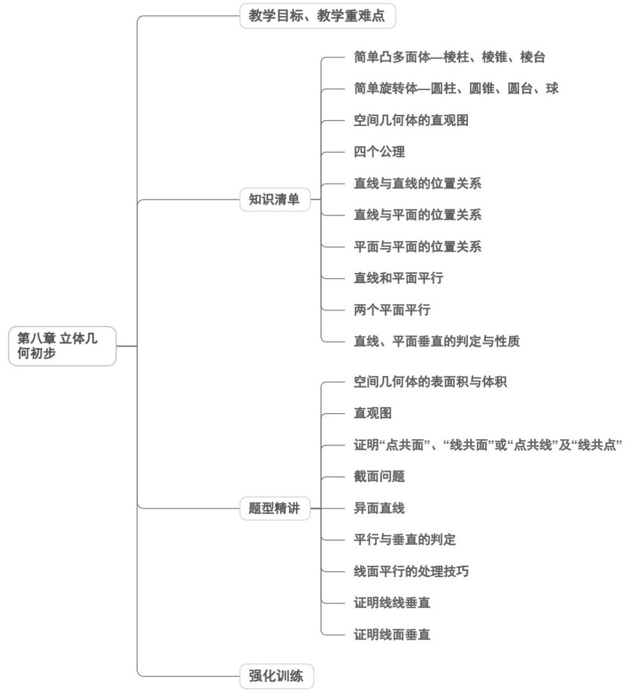

<!-- source-part:1 pages:1-50 -->

## 第八章 立体几何初步

## 教学目标、教学重难点

<table><tr><td>教学目标</td><td>1. 掌握空间几何体的核心特征:能识别柱、锥、台、球及简单组合体的结构本质(如棱柱“有两个面平行且其余各面为平行四边形”),区分多面体与旋转体的构成差异;能运用结构特征描述现实生活中物体的几何形态(如建筑、家具的几何体抽象)。2. 熟练运用空间图形的表示方法:掌握三视图(正视图、侧视图、俯视图)的绘制与识别,能实现立体模型与三视图的双向转化;学会用斜二侧画法规范绘制直观图,理解平行投影与中心投影的区别与应用场景。3. 理解空间基本要素的位置关系:以长方体为载体,抽象出点、线、面的定义,掌握平面基本性质(三大公理)及推论;明确空间直线的三种位置关系(平行、相交、异面),熟练运用线面平行、垂直、面面平行、垂直的判定定理与性质定理,能进行简单命题的论证。4. 掌握核心度量计算方法:了解柱、锥、台、球的表面积与体积计算公式(侧重理解推导逻辑,不强制记忆),能结合三视图或直观图计算简单几何体的度量值;初步学会运用空间几何知识解决实际度量问题(如容器容积、建筑用料估算)。5. 构建几何语言体系:能准确运用文字语言、图形语言、符号语言描述空间关系,实现三种语言的灵活转化,规范书写几何推理过程。</td></tr><tr><td>教学重难点</td><td>重点1. 掌握空间几何体的核心特征:能识别柱、锥、台、球及简单组合体的结构本质(如棱柱“有两个面平行且其余各面为平行四边形”),区分多面体与旋转体的构成差异;能运用结构特征描述现实生活中物体的几何形态(如建筑、家具的几何体抽象)。2. 熟练运用空间图形的表示方法:掌握三视图(正视图、侧视图、俯视图)的绘制与识别,能实现立体模型与三视图的双向转化;学会用斜二侧画法规范绘制直观图,理解平行投影与中心投影的区别与应用场景。3. 理解空间基本要素的位置关系:以长方体为载体,抽象出点、线、面的定义,掌握平面基本性质(三大公理)及推论;明确空间直线的三种位置关系(平行、相交、异面),熟练运用线面平行、垂直、面面平行、垂直的判定定理与性质定理,能进行简单命题的论证。4. 掌握核心度量计算方法:了解柱、锥、台、球的表面积约与体积计算公式(侧重理解推导逻辑,不强制记忆),能结合三视图或直观图计算简单几何体的度量值;初步学会运用空间几何知识解决实际度量问题(如容器容积、建筑用料估算)。5.构建几何语言体系:能准确运用文字语言、图形语言、符号语言描述空间关系,实现三种语言的灵活转化,规范书写几何推理过程。难点1.空间想象能力的建立:难点在于突破平面思维局限,理解平面的“无限延展性”(易将实物平面等同于数学平面),能在脑海中构建复杂几何体的三维结构,准确把握空间元素的相对位置关系。2.异面直线概念的理解与判定:学生易将异面直线与平行、相交直线混淆,难以直观感知“既不平行也不相交”的空间特征,需通过动态演示与实物观察突破认知障碍。3.几何定理的灵活应用与推理规范:线面、面面平行与垂直的判定定理和性质定理易混淆,难以准确选择定理进行推理;几何语言的规范表达(尤其是符号语言与图形语言的对应)是易错点,需强化推理步骤的逻辑性与严谨性。4.图形转化与模型构建:难点在于将实际问题抽象为空间几何模型,如将建筑结构转化为柱、锥组合体;在三视图还原立体图形时,易出现维度缺失或结构偏差,需通过大量变式训练提升转化能力。5.公理体系的抽象理解:对平面基本性质的公理化特征认识不足,难以运用公理解决抽象的共面、共线问题,需通过具象化演示(如三脚架定面、纸面相交)帮助内化本</td></tr></table>

![[高中/课堂同步/题库/人教A版高中数学同步讲义(2026)/02_必修第二册/第八章 立体几何初步/讲义/第八章_立体几何初步_高效培优讲义_/知识清单_sec_01/知识清单_sec_01.md]]
![[高中/课堂同步/题库/人教A版高中数学同步讲义(2026)/02_必修第二册/第八章 立体几何初步/讲义/第八章_立体几何初步_高效培优讲义_/知识点_01_简单凸多面体_棱柱_棱锥_棱台_sec_02/知识点_01_简单凸多面体_棱柱_棱锥_棱台_sec_02.md]]
![[高中/课堂同步/题库/人教A版高中数学同步讲义(2026)/02_必修第二册/第八章 立体几何初步/讲义/第八章_立体几何初步_高效培优讲义_/即学即练_sec_03/即学即练_sec_03.md]]
![[高中/课堂同步/题库/人教A版高中数学同步讲义(2026)/02_必修第二册/第八章 立体几何初步/讲义/第八章_立体几何初步_高效培优讲义_/知识点_02_简单旋转体_圆柱_圆锥_圆台_球_sec_04/知识点_02_简单旋转体_圆柱_圆锥_圆台_球_sec_04.md]]
![[高中/课堂同步/题库/人教A版高中数学同步讲义(2026)/02_必修第二册/第八章 立体几何初步/讲义/第八章_立体几何初步_高效培优讲义_/即学即练_sec_05/即学即练_sec_05.md]]
![[高中/课堂同步/题库/人教A版高中数学同步讲义(2026)/02_必修第二册/第八章 立体几何初步/讲义/第八章_立体几何初步_高效培优讲义_/知识点_03_空间几何体的直观图_sec_06/知识点_03_空间几何体的直观图_sec_06.md]]
![[高中/课堂同步/题库/人教A版高中数学同步讲义(2026)/02_必修第二册/第八章 立体几何初步/讲义/第八章_立体几何初步_高效培优讲义_/即学即练_sec_07/即学即练_sec_07.md]]
![[高中/课堂同步/题库/人教A版高中数学同步讲义(2026)/02_必修第二册/第八章 立体几何初步/讲义/第八章_立体几何初步_高效培优讲义_/即学即练_sec_08/即学即练_sec_08.md]]
![[高中/课堂同步/题库/人教A版高中数学同步讲义(2026)/02_必修第二册/第八章 立体几何初步/讲义/第八章_立体几何初步_高效培优讲义_/知识点_06_直线与平面的位置关系_sec_09/知识点_06_直线与平面的位置关系_sec_09.md]]
![[高中/课堂同步/题库/人教A版高中数学同步讲义(2026)/02_必修第二册/第八章 立体几何初步/讲义/第八章_立体几何初步_高效培优讲义_/知识点_07_平面与平面的位置关系_sec_10/知识点_07_平面与平面的位置关系_sec_10.md]]
![[高中/课堂同步/题库/人教A版高中数学同步讲义(2026)/02_必修第二册/第八章 立体几何初步/讲义/第八章_立体几何初步_高效培优讲义_/知识点_08_直线和平面平行_sec_11/知识点_08_直线和平面平行_sec_11.md]]
![[高中/课堂同步/题库/人教A版高中数学同步讲义(2026)/02_必修第二册/第八章 立体几何初步/讲义/第八章_立体几何初步_高效培优讲义_/即学即练_sec_12/即学即练_sec_12.md]]
![[高中/课堂同步/题库/人教A版高中数学同步讲义(2026)/02_必修第二册/第八章 立体几何初步/讲义/第八章_立体几何初步_高效培优讲义_/知识点_09_两个平面平行_sec_13/知识点_09_两个平面平行_sec_13.md]]
![[高中/课堂同步/题库/人教A版高中数学同步讲义(2026)/02_必修第二册/第八章 立体几何初步/讲义/第八章_立体几何初步_高效培优讲义_/即学即练_sec_14/即学即练_sec_14.md]]
![[高中/课堂同步/题库/人教A版高中数学同步讲义(2026)/02_必修第二册/第八章 立体几何初步/讲义/第八章_立体几何初步_高效培优讲义_/知识点_10_直线_平面垂直的判定与性质_sec_15/知识点_10_直线_平面垂直的判定与性质_sec_15.md]]
![[高中/课堂同步/题库/人教A版高中数学同步讲义(2026)/02_必修第二册/第八章 立体几何初步/讲义/第八章_立体几何初步_高效培优讲义_/即学即练_sec_16/即学即练_sec_16.md]]
![[高中/课堂同步/题库/人教A版高中数学同步讲义(2026)/02_必修第二册/第八章 立体几何初步/讲义/第八章_立体几何初步_高效培优讲义_/题型精讲_sec_17/题型精讲_sec_17.md]]
![[高中/课堂同步/题库/人教A版高中数学同步讲义(2026)/02_必修第二册/第八章 立体几何初步/讲义/第八章_立体几何初步_高效培优讲义_/题型01_空间几何体的表面积与体积_sec_18/题型01_空间几何体的表面积与体积_sec_18.md]]
![[高中/课堂同步/题库/人教A版高中数学同步讲义(2026)/02_必修第二册/第八章 立体几何初步/讲义/第八章_立体几何初步_高效培优讲义_/题型02_直观图_sec_19/题型02_直观图_sec_19.md]]
![[高中/课堂同步/题库/人教A版高中数学同步讲义(2026)/02_必修第二册/第八章 立体几何初步/讲义/第八章_立体几何初步_高效培优讲义_/题型_03_证明_点共面___线共面_或_点共线__sec_20/题型_03_证明_点共面___线共面_或_点共线__sec_20.md]]
![[高中/课堂同步/题库/人教A版高中数学同步讲义(2026)/02_必修第二册/第八章 立体几何初步/讲义/第八章_立体几何初步_高效培优讲义_/题型05_异面直线的判定_sec_21/题型05_异面直线的判定_sec_21.md]]
![[高中/课堂同步/题库/人教A版高中数学同步讲义(2026)/02_必修第二册/第八章 立体几何初步/讲义/第八章_立体几何初步_高效培优讲义_/题型06_平行与垂直的判定_sec_22/题型06_平行与垂直的判定_sec_22.md]]
![[高中/课堂同步/题库/人教A版高中数学同步讲义(2026)/02_必修第二册/第八章 立体几何初步/讲义/第八章_立体几何初步_高效培优讲义_/题型07_线面平行处理技巧_sec_23/题型07_线面平行处理技巧_sec_23.md]]
![[高中/课堂同步/题库/人教A版高中数学同步讲义(2026)/02_必修第二册/第八章 立体几何初步/讲义/第八章_立体几何初步_高效培优讲义_/题型08_证明线线垂直_sec_24/题型08_证明线线垂直_sec_24.md]]
![[高中/课堂同步/题库/人教A版高中数学同步讲义(2026)/02_必修第二册/第八章 立体几何初步/讲义/第八章_立体几何初步_高效培优讲义_/题型09_证明线面垂直_sec_25/题型09_证明线面垂直_sec_25.md]]
![[高中/课堂同步/题库/人教A版高中数学同步讲义(2026)/02_必修第二册/第八章 立体几何初步/讲义/第八章_立体几何初步_高效培优讲义_/强化训练_sec_26/强化训练_sec_26.md]]
