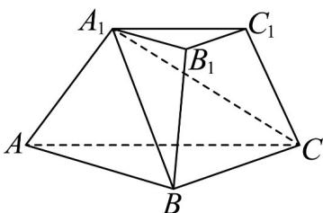

> [!faq]- 《第八章_立体几何初步_高效培优讲义_》官方解析
>
> > [!success]- **【答案】**  A.四棱台 B.四棱锥C.三棱台 D.三棱锥
>
> > [!note]- **【分析】**
> > 根据四棱锥的概念进行判断·
>
> > [!note]- **【解析】**
> > 由图可知：三棱台 $ABC - A_{1}B_{1}C_{1}$ 中，截去三棱锥 $A_{1} - ABC$
> >
> > 则剩余部分是以 $A_{1}$ 为顶点，以四边形 $BCC_{1}B_{1}$ 为底面的四棱锥.
> >
> > 故选：B
> >
> > 2. 北京大兴国际机场的显著特点之一是各种弯曲空间的运用。刻画空间的弯曲性是几何研究的重要内容。用
> >
> > 曲率刻画空间弯曲性，规定：多面体顶点的曲率等于 $2\pi$ 与多面体在该点的面角之和的差（多面体的面的内角
> >
> > 叫做多面体的面角，角度用弧度制），多面体面上非顶点的曲率均为零，多面体的总曲率等于该多面体各顶
> >
> > 点的曲率之和，例如：正四面体在每个顶点有 $^{3}$ 个面角，每个面角是 $^{3}$ ，所以正四面体在各顶点的曲率为
> >
> > $2\pi-3\times\frac{\pi}{3}=\pi$ ，故其总曲率为 $4\pi$ ，则五棱锥的总曲率为\_\_\_\_。
> >
> > 
> >
> > 【答案】 $4\pi$
> >
> > 【分析】由题意可知，五棱锥的总曲率等于五棱锥各顶点的曲率之和，可以从整个多面体的角度考虑，所有
> >
> > 顶点相关的面角就是多面体的所有多边形表面的内角的集合，
> >
> > 【详解】由图可知五棱锥有6个顶点，6个面，其中5个三角形，1个五边形，
> >
> > 所以五棱锥的表面内角和由 $^{5}$ 个为三角形， $^{1}$ 个为五边形组成，
> >
> > 所以面角和为 $5\pi + 3\pi = 8\pi$ ，故总曲率为 $6 \times 2\pi - 8\pi = 4\pi$ 。
> >
> > 
> >
> > 故答案为： $4\pi$ ：
