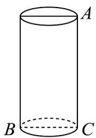

<!-- question-source:start -->
1. 如图，圆柱高 $8\mathrm{cm}$ ，底面半径 $2\mathrm{cm}$ ，一只蚂蚁从点 $A$ 爬到点 $B$ 处吃食，要爬行的最短路程为（）（π取
3）

A. $10\mathrm{cm}$ B. $14\mathrm{cm}$ C. $20\mathrm{cm}$ D.无法确定
<!-- question-source:end -->

![[高中/课堂同步/题库/人教A版高中数学同步讲义(2026)/02_必修第二册/第八章 立体几何初步/讲义/第八章_立体几何初步_高效培优讲义_/即学即练_sec_05/questions/answers/Q00065312A1.md]]
