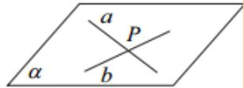
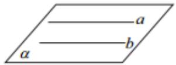

> [!faq]- 《第八章_立体几何初步_高效培优讲义_》官方解析
>
> > [!success]- **【答案】** A. 充分不必要条件 B. 必要不充分条件 C. 充要条件 D. 既不充分也不必要条 件
>
> > [!note]- **【分析】**
> > 根据空间中垂直和平行的性质及充分条件、必要条件、充要条件的定义分析判断即可·
>
> > [!note]- **【解析】**
> > 若 $a \perp b$ ， $b \perp c$ ，则 $a$ ， $c$ 可以异面、平行或相交，故由 $b \perp c$ 推不出 $a // c$ ，
> >
> > 若 $a \perp b$ ，a // c，根据平行线的性质，则 $b \perp c$ ，
> >
> > 所以“ $b \perp c$ ”是“ $a // c$ ”的必要不充分条件.
> >
> > 故选：B.
> >
> > 知识点 05 直线与直线的位置关系
> >
> > <table><tr><td>位置关系</td><td>相交(共面)</td><td>平行(共面)</td><td>异面</td></tr><tr><td>图形</td><td></td><td></td><td></td></tr><tr><td>符号</td><td>a∩b=P</td><td>a||b</td><td>a∩α=A,b⊂α,A∉b</td></tr><tr><td>公共点个数</td><td>1</td><td>0</td><td>0</td></tr><tr><td>特征</td><td>两条相交直线确定一个平面</td><td>两条平行直线确定一个平面</td><td>两条异面直线不同在如何一个平面内</td></tr></table>
