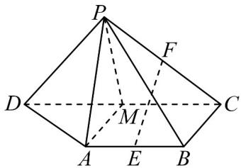

<!-- question-source:start -->
1．如图，在四棱锥 P-ABCD 中， $AB//CD$ ， $AB\perp BC$ ， $2AB=2BC=CD=PD=PC$ ，设 E,F,M 分别为棱

AB,PC,CD 的中点，证明： $EF//$ 平面 PAM .

<!-- question-source:end -->

![[高中/课堂同步/题库/人教A版高中数学同步讲义(2026)/02_必修第二册/第八章 立体几何初步/讲义/第八章_立体几何初步_高效培优讲义_/即学即练_sec_14/questions/answers/Q00065320A1.md]]
