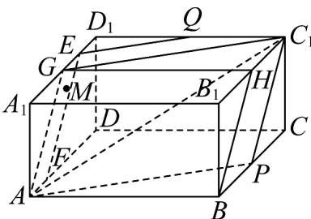

> [!faq]- 《第八章_立体几何初步_高效培优讲义_》官方解析
>
> > [!success]- **【答案】** 长方形 $ADD_{1}A_{1}$ 内一动点（含边界），若直线 $QM //$ 平面 $APC_{1}$ ，则点 $M$ 的轨迹长度为（）  A. $\sqrt{6}$ B. $2\sqrt{2}$ C. $2\sqrt{3}$ D. $3\sqrt{2}$
>
> > [!note]- **【分析】**
> > 利用过点 $Q$ 作平面 $APC_{1}$ 的平行平面 $QEF$ ，从而可得点 $M$ 的轨迹为线段 $EF$ ，即可计算长度，得出
> >
> > 结果·
>
> > [!note]- **【解析】**
> > 
> >
> > 在长方体 $ABCD - A_{1}B_{1}C_{1}D_{1}$ 中，取 $A_{1}D_{1}$ ， $B_{1}C_{1}$ 的中点 $G$ ， $H$ ，连接 $AG$ ， $GH$ ， $BH$ 由点 $P$ 为 $BC$ 的中点，得 $C_{1}H // BP$ ， $C_{1}H = BP$ ，则四边形 $BPC_{1}H$ 是平行四边形，所以 $BH // C_{1}P$ ，
> >
> > 又 $GH / / A_1B_1 / / AB$ ， $GH = A_{1}B_{1} = AB$ ，则四边形ABHG是平行四边形，
> >
> > 于是 $AG // BH // C_{1}P$
> >
> > 取 $GD_{1}$ 中点E，在AD上取点F，使得AF=GE，连接EF，QE，QF，
> >
> > 而 $AF // GE$ ，则四边形AGEF为平行四边形， $EF // AG$
> >
> > 而 $AG \subset$ 平面 $APC_{1}$ ， $EF \not\subset$ 平面 $APC_{1}$
> >
> > 于是 $EF / /$ 平面 $APC_{1}$
> >
> > 由 $Q$ 为 $C_1D_1$ 的中点， $E$ 为 $GD_{1}$ 中点，得 $QE // C_{1}G$
> >
> > 而 $C_{1}G \subset$ 平面 $APC_{1}$ ， $QE \notin$ 平面 $APC_{1}$ ，则 $QE //$ 平面 $APC_{1}$ ，
> >
> > 又 $EF \cap QE = E$ ，EF, QE ⊂ 平面 QEF，
> >
> > 因此平面 $QEF \parallel$ 平面 $APC_{1}$
> >
> > 又由直线 $QM \parallel$ 平面 $APC_{1}$ ，点 $M \in$ 平面 $ADD_{1}A_{1}$ ，
> >
> > 则点 M 在平面 QEF 与平面 $ADD_{1}A_{1}$ 的交线 EF 上，
> >
> > 从而点 M 的轨迹就是线段 EF ，
> >
> > $$
> > \text {而} E F = A G = \sqrt {A _ {1} G ^ {2} + A _ {1} A ^ {2}} = 3 \sqrt {2}
> > $$
> >
> > 所以点 M 的轨迹长度为 $3\sqrt{2}$ .
> >
> > 故选 **D**.
