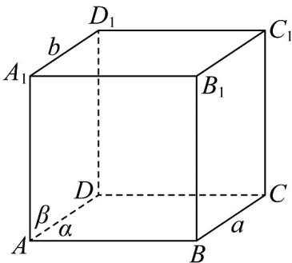

> [!faq]- 《第八章_立体几何初步_高效培优讲义_》官方解析
>
> > [!success]- **【答案】** C
>
> > [!note]- **【分析】**
> > 利用反例可判断 A,B,D 选项，根据线面平行的性质和判定定理可判断 C 选项.
>
> > [!note]- **【解析】**
> > 如图，正方体中，记底面 ABCD 为平面 $\alpha$ ，侧面 $ADD_{1}A_{1}$ 为平面 $\beta$ ， $B_{1}C_{1}$ 为 a，BC 为 b
> >
> > 显然满足 $\alpha \perp \beta$ ， $a\| \alpha$ ， $b\| \beta$ ，但是此时 $a / / b$ ，A不正确；
> >
> > 
> >
> > 如图，满足 $a \subset \alpha$ ， $b \subset \beta$ ， $a \parallel b$ ，但是此时 $\alpha \perp \beta$ ， $^{\mathrm{B}}$ 不正确；
> >
> > 
> >
> > 因为 $b / / \alpha, b / / \beta$ ，所以存在平面 $\gamma$ ，使得 $b \subset \gamma, \gamma \cap \alpha = m, \gamma \cap \beta = n$ ，根据线面平行的性质定理可得 $b / / m, b / / n$
> >
> > 所以 $m / / n$ ，又因为 $m\not\subset \beta ,n\subset \beta$ ，根据线面平行的判定定理可得 $m / / \beta$
> >
> > 而 $m \subset \alpha, \alpha \cap \beta = a$ ，所以 $m // a$ ，又因为 $b // m$ ，所以 $a // b$ ，C 正确；
> >
> > 因为 $a \perp \alpha$ ， $a // b$ ，所以 $b \perp \alpha$ ，因为 $b \perp \beta$ ，所以 $\alpha // \beta$ ，D 不正确。
> >
> > 故选 **C**.
