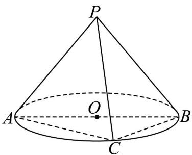

<!-- question-source:start -->
1. 如图， $AB$ 为圆锥底面直径，点 $C$ 是底面圆 $O$ 上异于 $A$ ， $B$ 的动点，已知 $OA = \sqrt{2}$ ，圆锥侧面展开图是圆心

角为 $\sqrt{2}\pi$ 的扇形，当 $PB$ 与 $BC$ 所成角为 $\frac{\pi}{3}$ 时， $PB$ 与 $AC$ 所成角为（）

A. $\frac{5\pi}{6}$ B. $\frac{\pi}{6}$ C. $\frac{\pi}{4}$ D. $\frac{\pi}{3}$
<!-- question-source:end -->

![[高中/课堂同步/题库/人教A版高中数学同步讲义(2026)/02_必修第二册/第八章 立体几何初步/讲义/第八章_立体几何初步_高效培优讲义_/强化训练_sec_26/questions/answers/Q00065351A1.md]]
