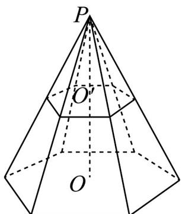

<!-- question-source:start -->
8. 如图所示，正六棱锥被过棱锥高 $PO$ 的中点 $O'$ 且平行于底面的平面所截，得到正六棱台 $OO'$ 和较小的棱锥 $PO'$

(1)求大棱锥，小棱锥，棱台的侧面面积之比；

(2)若大棱锥 $PO$ 的侧棱长为 $12\mathrm{cm}$ ，小棱锥的底面边长为 $4\mathrm{cm}$ ，求截得的棱台的侧面面积和表面积
<!-- question-source:end -->

![[高中/课堂同步/题库/人教A版高中数学同步讲义(2026)/02_必修第二册/第八章 立体几何初步/讲义/第八章_立体几何初步_高效培优讲义_/强化训练_sec_26/questions/answers/Q00065357A1.md]]
