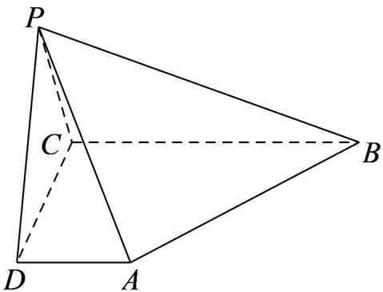

<!-- question-source:start -->
9. 如图，在四棱锥 $P - ABCD$ 中， $AD \perp$ 平面 $PDC$ ， $AD // BC, PD \perp PB, AD = 1$ ， $BC = 3, CD = 4, PD = 2$

(1)求异面直线 AP 与 BC 所成角的余弦值；

(2)求证： $PD\bot$ 平面PBC

(3)求直线 AB 与平面 PBC 所成角的正弦值.
<!-- question-source:end -->

![[高中/课堂同步/题库/人教A版高中数学同步讲义(2026)/02_必修第二册/第八章 立体几何初步/讲义/第八章_立体几何初步_高效培优讲义_/强化训练_sec_26/questions/answers/Q00065358A1.md]]
