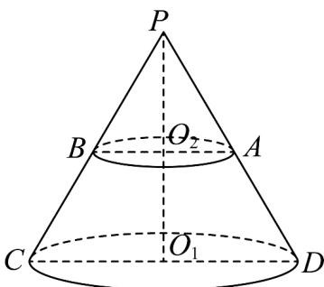

<!-- question-source:start -->
14．如图所示，圆锥 $PO_{1}$ 的轴截面PCD是面积为 $4\sqrt{3}$ 的正三角形，用平行于圆锥 $PO_{1}$ 底面的平面截该圆锥，截

面圆 $O_{2}$ 与 $PC$ ， $PD$ 分别交于点 $B$ ， $A$ ，且 $AB = 2$ ，则（）

A. 圆锥 $PO_{1}$ 的表面积为 $12\pi$

B. 圆台 $O_{1}O_{2}$ 的高为 $\sqrt{3}$

C. 圆锥 $PO_{2}$ 的体积为 $\frac{2\sqrt{3}}{3}\pi$

D．从点 C 出发沿着该圆锥侧面到达 AD 中点的最短路程为 5
<!-- question-source:end -->

![[高中/课堂同步/题库/人教A版高中数学同步讲义(2026)/02_必修第二册/第八章 立体几何初步/讲义/第八章_立体几何初步_高效培优讲义_/强化训练_sec_26/questions/answers/Q00065361A1.md]]
