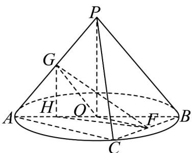

> [!faq]- 《第八章_立体几何初步_高效培优讲义_》官方解析
>
> > [!success]- **【答案】** D
>
> > [!note]- **【分析】**
> > 先求出圆锥的母线长为 $^{2}$ ，得到 $\triangle PBC$ 为等边三角形， $\forall ABC$ 为等腰直角三角形，作出辅助线，得
> >
> > 到 $\angle GOF$ （或其补角）即为 $PB$ 与 $AC$ 所成角，并由勾股定理和余弦定理求出各边长，利用余弦定理求出
> >
> > $\cos \angle GOF = -\frac{1}{2}$ ，求出 $\angle GOF$ ，进而得到 $PB$ 与 $AC$ 所成角大小
>
> > [!note]- **【解析】**
> > $OA = \sqrt{2}$ ，故圆锥底面积周长为 $2\sqrt{2}\pi$ ，设圆锥的母线长为 $l$ ，
> >
> > 圆锥侧面展开图是圆心角为 $\sqrt{2}\pi$ 的扇形，设扇形的半径为 $R$ ，则 $R = l$
> >
> > 则 $\sqrt{2}\pi l = 2\sqrt{2}\pi$ ，解得 $l = 2$ ，即 $PA = PB = PC = 2$
> >
> > $PB$ 与 $BC$ 所成角为 $\frac{\pi}{3}$ 时，所以 $\triangle PBC$ 为等边三角形， $BC = 2$ ，
> >
> > 又 $AB$ 为底面圆的直径，所以 $AC \perp BC$ ，又 $AB = 2\sqrt{2}$
> >
> > 由勾股定理得 $AC = \sqrt{AB^2 - BC^2} = 2$ ，故 $\forall ABC$ 为等腰直角三角形，
> >
> > 其中 $PA^2 + PB^2 = AB^2$ ，由勾股定理逆定理得 $PA \perp PB$
> >
> > 取 BC 的中点 F ，连接 OF ，则 $OF \parallel AC$ ， BF = 1 ，
> >
> > <!-- source-part:3 pages:101-123 -->
> >
> > 取 PA 的中点 G ，连接 OG ，则 $OG \parallel PB$
> >
> > 故 $\angle GOF$ （或其补角）即为 $PB$ 与 $AC$ 所成角，
> >
> > 连接 OP ，则 $OP \perp$ 平面 ABC ，取 AO 的中点 H ，连接 GH ，FH ，
> >
> > 则 $GH // OP$ ，故 $GH \perp$ 平面 $ABC$ ，又 $FH \subset$ 平面 $ABC$ ，所以 $GH \perp FH$ ，
> >
> > 其中 $PO = OA = OB = \frac{1}{2} AB = \sqrt{2}$ ， $OF = \frac{1}{2} AC = 1$ ， $OG = \frac{1}{2} PA = 1$
> >
> > $$
> > H G = \frac {1}{2} P O = \frac {\sqrt {2}}{2}, O H = \frac {\sqrt {2}}{2}, B H = \frac {\sqrt {2}}{2} + \sqrt {2} = \frac {3 \sqrt {2}}{2}
> > $$
> >
> > 在 $\triangle HBF$ 中，由余弦定理得
> >
> > $$
> > H F ^ {2} = B H ^ {2} + B F ^ {2} - 2 B H \cdot B F \cos \frac {\pi}{4} = \frac {9}{2} + 1 - 2 \times \frac {3 \sqrt {2}}{2} \times 1 \times \frac {\sqrt {2}}{2} = \frac {5}{2},
> > $$
> >
> > $$
> > \cos \angle G O F = \frac {G O ^ {2} + O F ^ {2} - G F ^ {2}}{2 G O \cdot O F} = \frac {1 + 1 - 3}{2} = - \frac {1}{2}
> > $$
> >
> > 所以 $\angle GOF = \frac{2\pi}{3}$ ，则 PB 与 AC 所成角大小为 $\frac{\pi}{3}$ .
> >
> > 
> >
> > 故选 **D**
