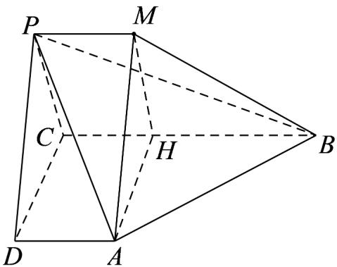

> [!faq]- 《第八章_立体几何初步_高效培优讲义_》官方解析
>
> > [!success]- **【答案】** (1) $\frac{\sqrt{5}}{5}$ (2)证明过程见解析 (3) $\frac{\sqrt{5}}{5}$
>
> > [!note]- **【分析】**
> > （1）异面直线 $AP$ 与 $BC$ 所成角为 $\angle PAD$ ，求出各边长，得到 $\cos \angle PAD = \frac{DA}{PA} = \frac{\sqrt{5}}{5}$
> >
> > (2) $BC \perp$ 平面 $PDC$ ，所以 $BC \perp PD$ ，结合 $PD \perp PB$ ，得到线面垂直；
> >
> > (3) 作出辅助线，得到线面垂直，直线 $AB$ 与平面 $PBC$ 所成角为 $\angle BAM$ ，求出各边长，求出正弦值
>
> > [!note]- **【解析】**
> > （1）因为 $AD // BC$ ，所以异面直线 $AP$ 与 $BC$ 所成角为 $\angle PAD$ ，
> >
> > 因为 $AD \perp$ 平面 PDC ， $PD \subset$ 平面 PDC ，所以 $AD \perp PD$
> >
> > 因为 AD = 1 ， PD = 2 ，所以 $AP = \sqrt{AD^{2} + PD^{2}} = \sqrt{5}$
> >
> > 所以 $\cos\angle PAD=\frac{DA}{PA}=\frac{1}{\sqrt{5}}=\frac{\sqrt{5}}{5}$ ;
> >
> > (2) 因为 $AD \perp$ 平面 PDC，AD // BC，所以 $BC \perp$ 平面 PDC，
> >
> > $PD \subset$ 平面 $PDC$ ，所以 $BC \perp PD$
> >
> > 因为 $PD \perp PB$ ， $BC \cap PB = B$ ， $BC, PB \subset$ 平面 PBC，
> >
> > 所以 $PD \perp$ 平面 PBC ;
> >
> > (3) 过点 $P$ 作 $PM \parallel BC$ ，且使得 $PM = AD = 1$ ，连接 $AM, BM$
> >
> > 因为 $AD // BC$ ，所以 $AD // PM$ ，所以四边形 $ADPM$ 为平行四边形，
> >
> > 故 $PD // AM$ ，
> >
> > 由（2）知， $PD \perp$ 平面PBC，所以 $AM \perp$ 平面PBC
> >
> > 因为 $BM \subset$ 平面 PBC ，所以 $AM \perp BM$
> >
> > 故直线 AB 与平面 PBC 所成角为 $\angle ABM$ ，
> >
> > 在 BC 上取点 H，使得 CH = 1，连接 AH, MH
> >
> > 因为 $CH \parallel AD$ ，所以四边形 $CHAD$ 为平行四边形，
> >
> > 故 $AH = CD = 4$ ， $PD = AM = 2$
> >
> > 因为 BC = 3 ，所以 BH = 2 ，
> >
> > 因为 $BC \perp$ 平面 PDC ， $CD \subset$ 平面 PDC ，所以 $BC \perp CD$ ， $AH \perp BC$
> >
> > 由勾股定理得 $AB = \sqrt{AH^{2} + BH^{2}} = \sqrt{16 + 4} = 2\sqrt{5}$
> >
> > 故 $\sin\angle ABM=\frac{AM}{AB}=\frac{\sqrt{5}}{5}$
> >
> > 
