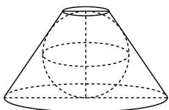
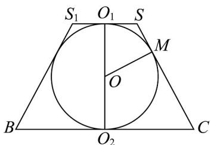

> [!faq]- 《第八章_立体几何初步_高效培优讲义_》官方解析
>
> > [!success]- **【答案】**  A. $100\pi$ B. $96\pi$ C. $88\pi$ D. $81\pi$
>
> > [!note]- **【分析】**
> > 先根据几何体轴截面结构特征依次求出台体母线长为 $l = r_{1} + r_{2}$ 和 $R^2 = r_1r_2$ ，接着结合题设条件得 $r_2 = \frac{4r_1}{r_1 - 1}\big(r_1\neq 1\big)$ 再由台体侧面积公式和基本不等式及其配凑法即可求解·
>
> > [!note]- **【解析】**
> > 如图为几何体的轴截面， $O_{1}, O_{2}$ 为上下底面中心，O 为球心，M 为球与母线的切点，
> >
> > 台体上下底半径分别为 $r_1, r_2$
> >
> > 
> >
> > 则 $\angle OMS = \angle OO_{1}S$ ，又因为 $OO_{1} = OM = R,OS = OS$
> >
> > 所以 $\triangle OMS$ 与 $\triangle OO_1S$ 全等，所以 $SM = O_1S = r_1$ ，同理可得 $CM = r_2$
> >
> > 所以台体母线长为 $l = r_{1} + r_{2}$
> >
> > 所以 $2R = \sqrt{\left(r_{1} + r_{2}\right)^{2} - \left(r_{2} - r_{1}\right)^{2}} = 2\sqrt{r_{1}r_{2}}$
> >
> > 则 $R^2 = r_1r_2 = 4r_1 + r_2\Rightarrow r_2 = \frac{4r_1}{r_1 - 1}\big(r_1\neq 1\big)$
> >
> > 所以台体的侧面积为 $\pi\left(r_{1}+r_{2}\right)l=\pi\left(r_{1}+r_{2}\right)^{2}$
> >
> > $$
> > = \pi \left(r _ {1} + \frac {4 r _ {1}}{r _ {1} - 1}\right) ^ {2} = \pi \left(r _ {1} - 1 + \frac {4}{r _ {1} - 1} + 5\right) ^ {2} \quad \pi \left(2 \sqrt {\left(r _ {1} - 1\right) \times \frac {4}{r _ {1} - 1}} + 5\right) ^ {2} = 8 1 \pi
> > $$
> >
> > 当且仅当 $r_{1}-1=\frac{4}{r_{1}-1}$ 即 $r_{1}=3$ 时等号成立.
> >
> > 圆台的侧面积最小值为 $81\pi$ .
> >
> > 故选 **D**
