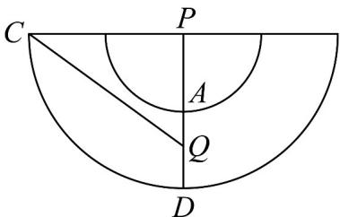

> [!faq]- 《第八章_立体几何初步_高效培优讲义_》官方解析
>
> > [!success]- **【答案】** ABD
>
> > [!note]- **【分析】**
> > 由轴截面面积求出底面半径，再由圆锥表面积公式得解判断 $^{A}$ ，根据平行线分线段成比例可得 $O_{1}O_{2}$
> >
> > 判断 B，由圆锥的体积公式求解判断 C，利用侧面展开图转化为线段求解判断 D.
>
> > [!note]- **【解析】**
> > 对于 A，设 $\triangle PCD$ 的边长为 a，由已知得 $\frac{1}{2}a \cdot a \cdot \frac{\sqrt{3}}{2} = 4\sqrt{3}$ ，解得 a = 4，
> >
> > 所以圆锥 $PO_{1}$ 的表面积为 $S = \pi \times 2 \times 4 + \pi \times 2^{2} = 12\pi$ ，故 A 正确；
> >
> > 对于 B，因为 CD = 4 ，所以 $PO_{1} = 2\sqrt{3}$ ，又 $AB = \frac{1}{2}CD$ ，
> >
> > 所以 $O_{1}O_{2}=\frac{1}{2}PO_{1}=\sqrt{3}$ ，故 B 正确；
> >
> > 对于 C，圆锥 $PO_{2}$ 的体积为 $V=\frac{1}{3}\pi\times1^{2}\times\sqrt{3}=\frac{\sqrt{3}}{3}\pi$ ，故 C 错误；
> >
> > 对于 $^{D}$ ，由已知得圆锥 $PO_{1}$ 的侧面展开图的圆心角 $\theta=\frac{2\pi\times2}{4}=\pi$ ，设AD的中点为Q，连接CQ，如图，
> >
> > 
> >
> > 可得 $\angle CPQ = \frac{\pi}{2}$ ，PC = 4， $PQ = 2 + 1 = 3$ ，则 $CQ = \sqrt{4^{2} + 3^{2}} = 5$ ，故 D 正确.
> >
> > 故选 **ABD**
