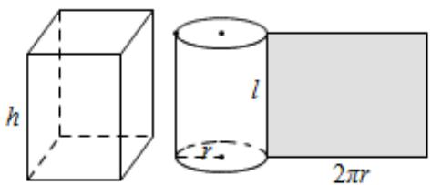
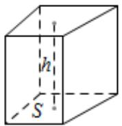

## 知识点 02 简单旋转体—圆柱、圆锥、圆台、球

表面积与体积计算公式

表面积公式

<table><tr><td rowspan="3">表面积</td><td>柱体</td><td> $S_{\text{直棱柱}} = ch + 2S_{\text{底}}$  $S_{\text{斜棱柱}} = c'l + 2S_{\text{底}} (c'$ 为直截面周长)  $S_{\text{圆锥}} = 2\pi r^{2} + 2\pi rl = 2\pi r(r+l)$ </td><td></td></tr><tr><td>锥体</td><td> $S_{\text{正棱锥}} = \frac{1}{2} nah' + S_{\text{底}}$  $S_{\text{圆锥}} = \pi r^{2} + \pi rl = \pi r(r+l)$ </td><td></td></tr><tr><td>台体球</td><td> $S_{\text{正棱台}} = \frac{1}{2} n(a+a')h + S_{\text{上}} + S_{\text{下}}$  $S_{\text{圆台}} = \pi (r'^{2} + r^{2} + r'l + rl)$  $S = 4\pi R^{2}$ </td><td> </td></tr></table>

## 体积公式

<table><tr><td rowspan="4">体积</td><td>柱体</td><td> $V_{\text{柱}} = Sh$ </td><td></td></tr><tr><td>锥体</td><td> $V_{\text{锥}} = \frac{1}{3}Sh$ </td><td></td></tr><tr><td>台体</td><td> $V_{\text{台}} = \frac{1}{3}(S + \sqrt{SS'} + S')h$ </td><td></td></tr><tr><td>球</td><td> $V = \frac{4}{3}\pi R^3$ </td><td></td></tr></table>
