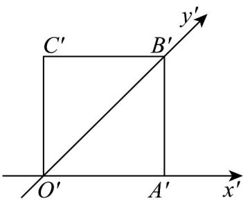
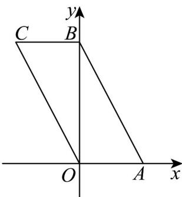
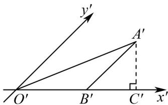

## 知识点 03 空间几何体的直观图

1. 斜二测画法

斜二测画法的主要步骤如下：

(1) 建立直角坐标系．在已知水平放置的平面图形中取互相垂直的 $Ox$ ， $Oy$ ，建立直角坐标系．

(2) 画出斜坐标系．在画直观图的纸上（平面上）画出对应图形．在已知图形平行于 $x$ 轴的线段，在直观图

中画成平行于 $O^{\prime}x^{\prime}$ ， $O^{\prime}y^{\prime}$ ，使 $\angle x^{\prime}O^{\prime}y^{\prime} = 45^{\circ}$ （或 $135^{\circ}$ ），它们确定的平面表示水平平面.

(3) 画出对应图形．在已知图形平行于 $x$ 轴的线段，在直观图中画成平行于 $x'$ 轴的线段，且长度保持不变；

在已知图形平行于 $y$ 轴的线段，在直观图中画成平行于 $y'$ 轴，且长度变为原来的一般。可简化为“横不变，纵

减半”.

(4) 擦去辅助线．图画好后，要擦去 $x'$ 轴、 $y'$ 轴及为画图添加的辅助线（虚线）．被挡住的棱画虚线．

注：直观图和平面图形的面积比为 $\sqrt{2}:4$ .

2. 平行投影与中心投影

平行投影的投影线是互相平行的，中心投影的投影线相交于一点。

【即学即练】

1. 如图，正方形 $O'A'B'C'$ 的边长为 1，它是按“斜二测画法”得到的一个水平放置的平面图形 $OABC$ 的直观图，则它的原图形 $OABC$ 的周长是（）

【答案】

A. 4 B. 6 C. $2 + 2\sqrt{2}$ D. 8

【答案】D
【分析】将直观图还原为平面图形是平行四边形，然后计算。
【详解】将直观图还原为平面图形，如图所示 $OB = 2O'B' = 2\sqrt{2}$ ， $OA = O'A' = 1$ ，所以 $AB = \sqrt{1^2 + (2\sqrt{2})^2} = 3$

所以原图形的周长为 $8cm$

故选：D.

2. 如图， $\triangle A'B'O'$ 是利用斜二测画法画出的 Rt $\triangle ABO$ （ $\angle ABO$ 为直角）的直观图，Rt $\triangle ABO$ 的面积为 16

图中 $O'B' = 4$ ，过点 $A'$ 作 $A'C' \perp x'$ 轴于点 $C'$ ，则 $A'C'$ 的长为（）

A. 1 B. $\sqrt{2}$ C. $2\sqrt{2}$ D. $4\sqrt{2}$

【答案】C

【分析】利用面积公式求出原 $\triangle ABO$ 的高 AB，进而求出 $A'B'$ ，然后在 $Rt\triangle A'B'C'$ 中求解即可.

【详解】在 $\triangle ABO$ 中， $\angle ABO = \frac{\pi}{2}$ ，由 $\triangle ABO$ 的面积为 16， $OB = O'B' = 4$

得 $\frac{1}{2} AB\cdot OB = 16$ ，则 $AB = 8$ ， $A^{\prime}B^{\prime} = 4$ ，而 $\angle A'B'C' = \frac{\pi}{4}$ ， $A^{\prime}C^{\prime}\perp x^{\prime}$ 轴于点 $C^\prime$

所以 $A^{\prime}C^{\prime}=A^{\prime}B^{\prime}\cdot\sin\frac{\pi}{4}=4\times\frac{\sqrt{2}}{2}=2\sqrt{2}$

故选：C

知识点 04 四个公理

公理 $^{1}$ ：如果一条直线上的两点在一个平面内，那么这条直线在此平面内。

注意：（1）此公理是判定直线在平面内的依据；（2）此公理是判定点在面内的方法

公理 $^{2}$ ：过不在一条直线上的三点，有且只有一个平面．

注意：（1）此公理是确定一个平面的依据；（2）此公理是判定若干点共面的依据

推论①：经过一条直线和这条直线外一点，有且只有一个平面；

注意：（1）此推论是判定若干条直线共面的依据

(2) 此推论是判定若干平面重合的依据

(3) 此推论是判定几何图形是平面图形的依据

推论②：经过两条相交直线，有且只有一个平面；

推论③：经过两条平行直线，有且只有一个平面；

公理 $^{3}$ ：如果两个不重合的平面有一个公共点，那么它们有且只有一条过该点的公共直线。

注意：（1）此公理是判定两个平面相交的依据

(2) 此公理是判定若干点在两个相交平面的交线上的依据（比如证明三点共线、三线共点）

(3) 此推论是判定几何图形是平面图形的依据

公理 $^{4}$ ：平行于同一条直线的两条直线互相平行。
