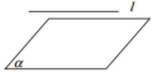
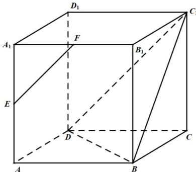
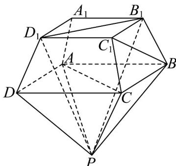

## 知识点 06 直线与平面的位置关系

有直线在平面内、直线与平面相交、直线与平面平行三种情况。

<table><tr><td>位置关系</td><td>包含(面内线)</td><td>相交(面外线)</td><td>平行(面外线)</td></tr><tr><td>图形</td><td></td><td></td><td></td></tr><tr><td>符号</td><td> $l \subset \alpha$ </td><td> $l \cap \alpha = P$ </td><td> $l \parallel \alpha$ </td></tr><tr><td>公共点个数</td><td>无数个</td><td>1</td><td>0</td></tr></table>

【即学即练】

1. 如图，正方体 $ABCD - A_{1}B_{1}C_{1}D_{1}, E, F$ 分别是 $AA_{1}, A_{1}B_{1}$ 的中点.

(1)求异面直线 EF 与 $BC_{1}$ 所成角的大小；

(2)证明： $EF \parallel$ 平面 $BC_{1}D$ .

【答案】(1) $\frac{\pi}{3}$

(2)证明见解析

【分析】（ $^{1}$ ）作出异面直线所成的角，利用三角形的边角关系求角·

(2) 根据线面平行的判定定理证明线面平行.

【详解】（1）连接 $AB_{1}$ ，如图：

因为 E，F 分别为 $AA_{1}$ ， $A_{1}B_{1}$ 的中点，所以 $EF // AB_{1}$

又 $ABCD - A_{1}B_{1}C_{1}D_{1}$ 为正方体，所以 $AB_{1} / / DC_{1}$

所以 $EF \parallel DC_{1}$ .

所以 $\angle DC_{1}B$ 即为异面直线 EF 与 $BC_{1}$ 所成的角.

又 $\triangle BC_{1}D$ 为等边三角形，所以 $\angle DC_{1}B=\frac{\pi}{3}$

即异面直线 EF 与 $BC_{1}$ 所成角为 $\frac{\pi}{3}$ .

(2) 由 (1) 知： $EF // C_{1}D$ ， $EF \not\subset$ 平面 $BC_{1}D$ ， $C_{1}D \subset$ 平面 $BC_{1}D$

所以 EF // 平面 $BC_{1}D$ .

2. 如图为正四棱台 $ABCD - A_1B_1C_1D_1$ 与正四棱锥 $P - ABCD$ 拼接而成的几何体

证明： $AC \perp$ 平面 $PB_{1}D_{1}$ .

【答案】证明见解析

【分析】记 AC 与 BD 的交点为 O， $A_{1}C_{1}$ 与 $B_{1}D_{1}$ 的交点为 $O_{1}$ ，由正四棱台和正四棱锥结构性质结合线面垂直

的性质定理求证 $AC \perp PO_{1}$ 和 $AC \perp B_{1}D_{1}$ ，再根据线面垂直的判定定理即可得证。

【详解】证明：记 AC 与 BD 的交点为 O， $A_{1}C_{1}$ 与 $B_{1}D_{1}$ 的交点为 $O_{1}$ ，

则由正四棱台和正四棱锥结构性质可得 $PO \perp$ 平面ABCD， $OO_{1} \perp$ 平面ABCD，且 $AC \perp BD$

又 $PO \cap OO_{1} = O$ ，所以 $O, O_{1}, P$ 三点共线，

又因为 $AC \subset$ 平面ABCD，则 $AC \perp PO$ ，即 $AC \perp PO_{1}$

又由正四棱台结构性质可知 $BD // B_{1}D_{1}$ ，所以 $AC \perp B_{1}D_{1}$

因为 $PO_{1} \cap BD = O_{1}$ ， $PO \subset$ 平面 $PB_{1}D_{1}$ ， $B_{1}D_{1} \subset$ 平面 $PB_{1}D_{1}$

故 $AC \perp$ 平面 $PB_{1}D_{1}$ .
