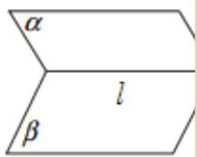
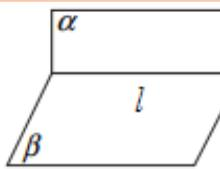

## 知识点 07 平面与平面的位置关系

有平行、相交两种情况。

<table><tr><td>位置关系</td><td>平行</td><td>相交(但不垂直)</td><td colspan="2">垂直</td></tr><tr><td>图形</td><td></td><td colspan="2"></td><td></td></tr><tr><td>符号</td><td>α∥β</td><td>α∩β=l</td><td colspan="2">α⊥β,α∩β=l</td></tr><tr><td>公共点个数</td><td>0</td><td>无数个公共点且都在唯一的一条直线上</td><td colspan="2">无数个公共点且都在唯一的一条直线上</td></tr></table>

【即学即练】

1．如图，在棱长为 $^{4}$ 的正方体 $ABCD-A_{1}B_{1}C_{1}D_{1}$ 中．点P是棱 $CC_{1}$ 的中点，动点Q在面 $DCC_{1}D_{1}$ 内，包括边

界），若 $AQ \parallel$ 平面 $A_{1}BP$ ，则线段 $AQ$ 长度的取值范围是\_\_\_\_。

【答案】 $\left[3\sqrt{2}, 2\sqrt{5}\right]$

【分析】通过构造面面平行的方法，判断出 $Q$ 点的轨迹，从而求得 $AQ$ 的取值范围

【详解】设 $Q_{1},Q_{2}$ 分别是 $DD_{1},DC$ 的中点，连接 $AQ_{1},AQ_{2},Q_{1}Q_{2},PQ_{1}$

根据正方体的性质可知 $Q_{1} Q_{2} / / D_{1} C / / A_{1} B$

由于 $D_{1}C \notin$ 平面 $A_{1}BP$ ， $D_{1}C //$ 平面 $A_{1}BP$

所以 $Q_{1}Q_{2} / /$ 平面 $A_{1}BP$

又因 $PQ_{1} // DC // AB, PQ_{1} = DC = AB$ ，可得 $\square ABPQ_{1}$ ，则得 $AQ_{1} // BP$

由于 $AQ_{1} \notin$ 平面 $A_{1}BP$ ， $BP \subset$ 平面 $A_{1}BP$ ，所以 $AQ_{1} //$ 平面 $A_{1}BP$

由于 $AQ_{1} \cap Q_{1}Q_{2} = Q_{1}, AQ_{1}, Q_{1}Q_{2} \subset$ 平面 $AQ_{1}Q_{2}$

所以平面 $AQ_{1}Q_{2} \parallel$ 平面 $A_{1}BP$

因为 $AQ \subset$ 平面 $AQ_{1}Q_{2}$ ，所以 $AQ \parallel$ 平面 $A_{1}BP$ ，

而 $Q \in$ 平面 $DCC_{1}D_{1}$ ， $Q \in$ 平面 $AQ_{1}Q_{2}$ ，平面 $DCC_{1}D_{1} \cap$ 平面 $AQ_{1}Q_{2} = Q_{1}Q_{2}$

故点 $Q$ 的轨迹即线段 $Q_{1}Q_{2}$

$$
A Q _ {1} = A Q _ {2} = \sqrt {4 ^ {2} + 2 ^ {2}} = 2 \sqrt {5}, Q _ {1} Q _ {2} = \sqrt {2 ^ {2} + 2 ^ {2}} = 2 \sqrt {2}
$$

三角形 $AQ_{1}Q_{2}$ 是等腰三角形，底边 $Q_{1}Q_{2}$ 上的高为 $\sqrt{\left(2\sqrt{5}\right)^2 - \left(\frac{2\sqrt{2}}{2}\right)^2} = 3\sqrt{2}$

所以 AQ 的取值范围是 $\left[3\sqrt{2},2\sqrt{5}\right]$ .

故答案为： $[3\sqrt{2}, 2\sqrt{5}]$

2. 已知 $\alpha$ 、 $\beta$ 是不同的平面， $m$ 为 $\beta$ 内的一条直线，则“ $\alpha \perp \beta$ ”是“ $m \perp \alpha$ ”的（）条件
A. 充分不必要条件 B. 必要不充分条件
C. 充要条件 D. 既不充分也不必要条件

【答案】B

【分析】利用面面垂直的判定定理和性质定理即可作出判断·

【详解】非充分性： $\alpha\perp\beta,m\subset\beta$ 不能推出 $m\perp\alpha$

必要性： $m\perp \alpha ,m\subset \beta \Rightarrow \alpha \perp \beta$

则“ $\alpha\perp\beta$ ”是“ $m\perp\alpha$ ”的必要不充分条件.

故选：B
