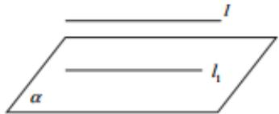

## 知识点 08 直线和平面平行

判定方法（文字语言、图形语言、符号语言）

<table><tr><td></td><td>文字语言</td><td colspan="2">图形语言</td><td>符号语言</td></tr><tr><td>线∥线⇒线∥面</td><td>如果平面外的一条直线和这个平面内的一条直线平行,那么这条直线和这个平面平行(简记为“线线平行⇒线面平行</td><td colspan="2"></td><td> $\begin{array}{c} l\parallel l_1 \\ l_1 \subset \alpha \\ l \notin \alpha \end{array} \Rightarrow l\parallel \alpha$ </td></tr><tr><td>面∥面⇒线∥面</td><td>如果两个平面平行,那么在一个平面内的所有直线都平行于另一个平面</td><td colspan="2"></td><td> $\begin{array}{c}\alpha\parallel \beta \\ a \subset \alpha \end{array} \Rightarrow a\parallel \beta$ </td></tr></table>

## 性质定理（文字语言、图形语言、符号语言）

<table><tr><td></td><td>文字语言</td><td>图形语言</td><td>符号语言</td></tr><tr><td>线||面⇒线||线</td><td>如果一条直线和一个平面平行,经过这条直线的平面和这个平面相交,那么这条直线就和交线平行</td><td></td><td> $\left.\begin{matrix} l\parallel & \alpha \\ l \subset \beta \\ \alpha \cap \beta = l' \end{matrix}\right\} \Rightarrow l\parallel$ </td></tr></table>
