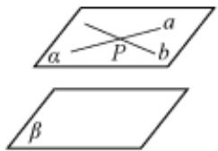
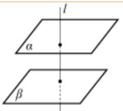
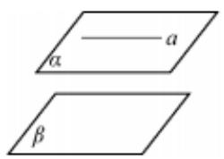
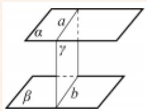
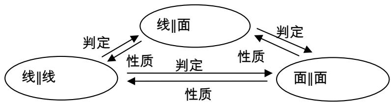

## 知识点 09 两个平面平行

## 判定方法（文字语言、图形语言、符号语言）

<table><tr><td></td><td>文字语言</td><td>图形语言</td><td>符号语言</td></tr><tr><td rowspan="2">判定定理</td><td rowspan="2">如果一个平面内有两条相交的直线都平行于另一个平面,那么这两个平面平行(简记为“线面平行⇒ 面面平行)</td><td rowspan="2"></td><td>a⊂α,b⊂α,a∩b=P</td></tr><tr><td>a∥β,b∥β⇒α∥β</td></tr><tr><td>线∥面⇒ 面</td><td>如果两个平面同垂直于一条直线,那么这两个平面平行</td><td></td><td>l⊥αl⊥β⇒α∥β</td></tr></table>

性质定理（文字语言、图形语言、符号语言）

<table><tr><td></td><td>文字语言</td><td>图形语言</td><td>符号语言</td></tr><tr><td>面//面⇒线//面</td><td>如果两个平面平行,那么在一个平面中的所有直线都平行于另外一个平面</td><td></td><td> $\left.\begin{matrix} \alpha //\beta \\ a \subset \alpha \end{matrix}\right\} \Rightarrow a //\beta$ </td></tr><tr><td>性质定理</td><td>如果两个平行平面同时和第三个平面相交,那么他们的交线平行(简记为“面面平行⇒线面平行”)</td><td></td><td> $\left.\begin{matrix} \alpha //\beta \\ \alpha \cap \gamma = a \\ \beta \cap \gamma = b \end{matrix}\right\} \Rightarrow a //b$ </td></tr><tr><td>面//面⇒线⊥面</td><td>如果两个平面中有一个垂直于一条直线,那么另一个平面也垂直于这条直线</td><td></td><td> $\left.\begin{matrix} \alpha //\beta \\ l \perp \alpha \end{matrix}\right\} \Rightarrow l \perp \beta$ </td></tr></table>

方法技巧与总结：线线平行、线面平行、面面平行的转换如图所示。

(1) 证明直线与平面平行的常用方法：

① 利用定义，证明直线 $a$ 与平面 $\alpha$ 没有公共点，一般结合反证法证明；

②利用线面平行的判定定理，即线线平行 $\Rightarrow$ 线面平行．辅助线的作法为：平面外直线的端点进平面，同向进

面，得平行四边形的对边，不同向进面，延长交于一点得平行于第三边的线段；

③利用面面平行的性质定理，把面面平行转化成线面平行；

(2) 证明面面平行的常用方法：

①利用面面平行的定义，此法一般与反证法结合；

②利用面面平行的判定定理；

③利用两个平面垂直于同一条直线；

④证明两个平面同时平行于第三个平面.

(3) 证明线线平行的常用方法：①利用直线和平面平行的判定定理；②利用平行公理；
