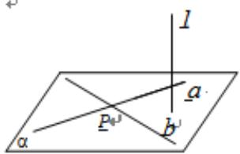
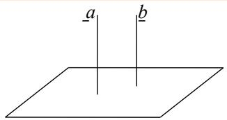
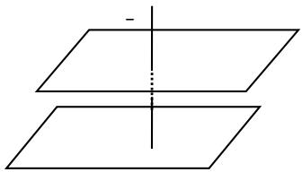
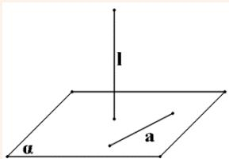
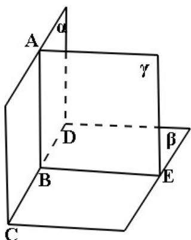
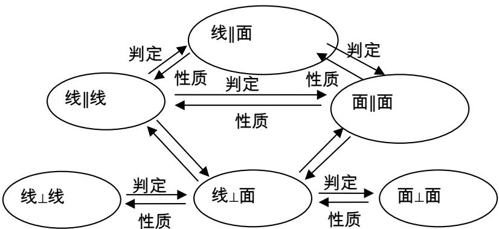

## 知识点 10 直线、平面垂直的判定与性质

判定定理（文字语言、图形语言、符号语言）

<table><tr><td></td><td>文字语言</td><td>图形语言</td><td>符号语言</td></tr><tr><td>判断定理</td><td>一条直线与一个平面内的两条相交直线都垂直,则该直线与此平面垂直</td><td></td><td> $\left.\begin{matrix}a,b\subset\alpha \\a\perp l \\b\perp l \\a\cap b=P\end{matrix}\right\} \Rightarrow l\perp\alpha$ </td></tr><tr><td>面⊥面⇒线⊥面</td><td>两个平面垂直,则在一个平面内垂直于交线的直线与另一个平面垂直</td><td></td><td>α⊥βα∩β=a b⊂β b⊥a⇒b⊥α</td></tr><tr><td>平行与垂直的关系</td><td>一条直线与两平行平面中的一个平面垂直,则该直线与另一个平面也垂直</td><td></td><td>α∥βa⊥α⇒a⊥β</td></tr><tr><td>平行与垂直的关系</td><td>两平行直线中有一条与平面垂直,则另一条直线与该平面也垂直</td><td></td><td>a∥ba⊥α⇒b⊥α</td></tr></table>

性质定理（文字语言、图形语言、符号语言）

<table><tr><td></td><td>文字语言</td><td>图形语言</td><td>符号语言</td></tr><tr><td>性质定理</td><td>垂直于同一平面的两条直线平行</td><td></td><td> $\left.\begin{matrix}a//\alpha \\a\subset\beta \\\alpha\cap\beta=b\end{matrix}\right\} \Rightarrow a//$ </td></tr></table>

<table><tr><td></td><td>文字语言</td><td>图形语言</td><td>符号语言</td></tr><tr><td>垂直与平行的关系</td><td>垂直于同一直线的两个平面平行</td><td></td><td> $\left.\begin{matrix}a \perp \alpha \\ a \perp \beta\end{matrix}\right\} \Rightarrow \alpha // \beta$ </td></tr><tr><td>线垂直于面的性质</td><td>如果一条直线垂直于一个平面,则该直线与平面内所有直线都垂直</td><td></td><td> $l \perp \alpha, a \subset \alpha \Rightarrow l \perp a$ </td></tr></table>

平面与平面垂直的定义

如果两个相交平面的交线与第三个平面垂直，又这两个平面与第三个平面相交所得的两条交线互相垂直。

(如图所示，若 $\alpha\cap\beta=CD,CD\perp\gamma$ ，且 $\alpha\cap\gamma=AB,\beta\cap\gamma=BE,AB\perp BE$ ，则 $\alpha\perp\beta$ )

一般地，两个平面相交，如果它们所成的二面角是直二面角，就说这两个平面互相垂直。

判定定理（文字语言、图形语言、符号语言）

<table><tr><td></td><td>文字语言</td><td>图形语言</td><td>符号语言</td></tr><tr><td>判定定理</td><td>一个平面过另一个平面的垂线,则这两个平面垂直</td><td></td><td> $\left.\begin{matrix}b \perp \alpha \\ b \subset \beta\end{matrix}\right\} \Rightarrow \alpha \perp \beta$ </td></tr></table>

性质定理（文字语言、图形语言、符号语言）

<table><tr><td></td><td>文字语言</td><td>图形语言</td><td>符号语言</td></tr><tr><td>性质定理</td><td>两个平面垂直,则一个平面内垂直于交线的直线与另一个平面垂直</td><td></td><td> $\left.\begin{matrix}\alpha\perp\beta \\ \alpha\cap\beta=a \\ b\subset\beta \\ b\perp a\end{matrix}\right\} \Rightarrow b\perp\alpha$ </td></tr></table>

方法技巧与总结：

线⊥线 $\xleftarrow{判定定理}$ 线⊥面 $\xleftarrow{判定定理}$ 面⊥面
性质定理 性质定理

(1) 证明线线垂直的方法

①等腰三角形底边上的中线是高；②勾股定理逆定理；③菱形对角线互相垂直；④直径所对的圆周角是直角；

⑤向量的数量积为零；⑥线面垂直的性质 $(a\perp\alpha,b\subset\alpha\Rightarrow a\perp b)$ ；⑦平行线垂直直线的传递性（

$$
a \perp c, a / / b \Rightarrow b \perp c) .
$$

(2) 证明线面垂直的方法

①线面垂直的定义；②线面垂直的判定（ $a \perp b, a \perp c, c \subset \alpha, b \subset \alpha, b \cap c = P \Rightarrow a \perp \alpha$ ）；③面面垂直的性质（

$\alpha\perp\beta,\alpha\cap\beta=b,a\perp b,a\subset\alpha\Rightarrow a\perp\beta$ ；平行线垂直平面的传递性 $(a\perp\alpha,b//a\Rightarrow b\perp\alpha)$ ；

⑤面面垂直的性质（ $\alpha\perp\gamma,\beta\perp\gamma,\alpha\cap\beta=l\Rightarrow l\perp\gamma$ ）.

(3) 证明面面垂直的方法

① 面面垂直的定义；② 面面垂直的判定定理（ $a \perp \beta, a \subset \alpha \Rightarrow \alpha \perp \beta$ ）.

空间中的线面平行、垂直的位置关系结构图如图所示，由图可知，线面垂直在所有关系中处于核心位置。

