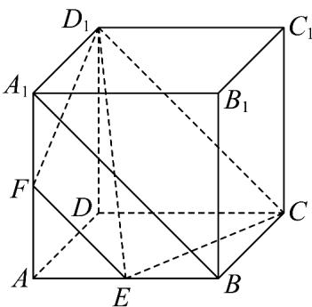

> [!faq]- 《第八章_立体几何初步_高效培优讲义_》官方解析
>
> > [!success]- **【答案】** $\frac{7}{17}$
>
> > [!note]- **【分析】**
> > 根据题意作出截面，利用台体体积公式计算较小部分的体积 $V_{1}$ ，然后可求 $V_{2}$ 即可求解
>
> > [!note]- **【解析】**
> > 设 $AA_{1}$ 中点为F
> >
> > 
> >
> > 又 $E$ 为线段 $AB$ 的中点，所以 $EF \parallel BA_{1}$
> >
> > 又正方体 $ABCD - A_{1}B_{1}C_{1}D_{1}$ 中， $CD_{1} \parallel BA_{1}$ ，所以 $EF \parallel CD_{1}$
> >
> > 所以 $E, F, D_{1}, C$ 四点共面，即过点 $C, E, D_{1}$ 的平面为平面 $EFD_{1}C$
> >
> > 不妨设正方体边长为 $^{1}$ ，易知多面体 $AEF - DCD_{1}$ 为三棱台，
> >
> > $$
> > S _ {\triangle A E F} = \frac {1}{2} \times \frac {1}{2} \times \frac {1}{2} = \frac {1}{8}, S _ {\triangle D C D _ {1}} = \frac {1}{2} \times 1 \times 1 = \frac {1}{2},
> > $$
> >
> > $$
> > V _ {1} = V _ {A E F - D C D _ {1}} = \frac {1}{3} \times \left(\frac {1}{8} + \frac {1}{2} + \sqrt {\frac {1}{8} \times \frac {1}{2}}\right) \times 1 = \frac {7}{2 4}, V _ {2} = 1 - \frac {7}{2 4} = \frac {1 7}{2 4}
> > $$
> >
> > $$
> > \therefore \frac {V _ {1}}{V _ {2}} = \frac {\frac {7}{2 4}}{\frac {1 7}{2 4}} = \frac {7}{1 7}.
> > $$
> >
> > 故答案为： $\frac{7}{17}$
