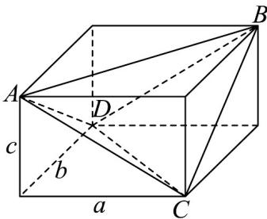
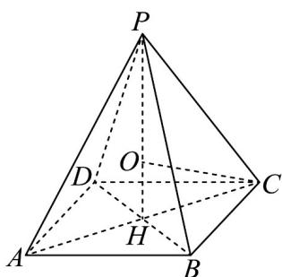

## 题型01 空间几何体的表面积与体积

【典例1】已知三棱锥 $A - BCD$ 中，且 $AB = CD = \sqrt{6}$ ， $BC = AD = 2\sqrt{2}$ ， $AC = BD = \sqrt{10}$ ，则该三棱锥外

接球的表面积为（ ）A. $12\pi$ B. $36\pi$ C. $4\sqrt{3}\pi$ D. $12\sqrt{3}\pi$

【答案】A

【分析】将三棱锥补成长方体，利用长方体的体对角线与三棱锥外接球直径的关系，求出外接球半径，进而

求出外接球的表面积·

【详解】将三棱锥 A-BCD 补成长方体，如图，

设长方体的长、宽、高分别为 a, b, c，

由于三棱锥 $A - BCD$ 的棱长满足 $AB = CD = \sqrt{6}$ ， $BC = AD = 2\sqrt{2}$ ， $AC = BD = \sqrt{10}$

根据长方体面对角线的性质，可得 $\left\{\begin{aligned}a^{2}+b^{2}&=6\\ b^{2}+c^{2}&=8\\ a^{2}+c^{2}&=10\end{aligned}\right.$ ，即 $a^{2}+b^{2}+c^{2}=12$

所以长方体的体对角线长为 $2\sqrt{3}$ ，因此三棱锥的外接球直径 $2R = 2\sqrt{3}$ ，所以 $R = \sqrt{3}$

所以外接球的表面积 $S = 4\pi R^{2} = 12\pi$ .

故选：A

【典例2】正四棱锥 $P - ABCD$ 的体积为 $8, AB = 2\sqrt{2}$ ，若该四棱锥的顶点均在一个球面上，则这个球的表面积为（）.

A. $9\pi$ B. $\frac{121\pi}{9}$ C. $\frac{169\pi}{9}$ D. $25\pi$

【答案】C

【分析】根据题意画出图形，由体积可算得正四棱锥的高，再由勾股定理可求得外接球的半径，进而求得其

表面积·

【详解】如图，设 O 为外接球球心， $PH \perp$ 底面 ABCD 于点 H，设 OP = OC = R

由正四棱锥 $P - ABCD$ 的体积为8，即 $\frac{1}{3}\cdot (2\sqrt{2})^2\cdot PH = 8$ ，解得 $PH = 3$ ，则 $OH = 3 - R$

又 $AB = 2\sqrt{2}$ ，所以 $AC = 4$ ， $HC = \frac{1}{2} AC = 2$

在 Rt△OHC 中， $OH^{2} + HC^{2} = OC^{2}$ ，即 $(3 - R)^{2} + 2^{2} = R^{2}$ ，解得 $R = \frac{13}{6}$ ，

所以外接球的表面积为 $4\pi R^{2} = 4\pi \times \left( \frac{13}{6} \right)^{2} = \frac{169\pi}{9}$ .

故选：C.

## 方法技巧

熟悉几何体的表面积、体积的基本公式，注意直角等特殊角.

![[高中/课堂同步/题库/人教A版高中数学同步讲义(2026)/02_必修第二册/第八章 立体几何初步/讲义/第八章_立体几何初步_高效培优讲义_/题型01_空间几何体的表面积与体积_sec_18/questions/Q00065324.md]]
![[高中/课堂同步/题库/人教A版高中数学同步讲义(2026)/02_必修第二册/第八章 立体几何初步/讲义/第八章_立体几何初步_高效培优讲义_/题型01_空间几何体的表面积与体积_sec_18/questions/Q00065325.md]]
![[高中/课堂同步/题库/人教A版高中数学同步讲义(2026)/02_必修第二册/第八章 立体几何初步/讲义/第八章_立体几何初步_高效培优讲义_/题型01_空间几何体的表面积与体积_sec_18/questions/Q00065326.md]]
